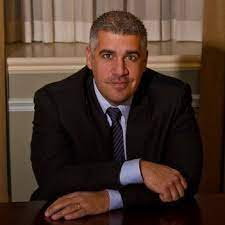

== Foreword

I felt a little nervous when Darcy asked me to write this foreword.

You see, I'm not the biggest Scrum Master cheerleader in the world.

In fact, in many of the Agile transformations I've led, one of our success metrics is how close we come to making the Scrum Master completely unnecessary.

That's not to say I'm against Scrum. I believe Scrum is the right Agile framework to use when starting a new project.

=== The role of the Scrum Master

.Sal Pece, Xennail CEO

I advocate for Scrum, but I also advocate for teams to evolve to such an advanced level of Agile understanding that they don't really need a Scrum Master.

The role of the Scrum Master is to teach, coach, and mentor others in the ways of Scrum, while acting as a leader who serves as the team during an Agile transition.

But here's the thing about transitions: they eventually reach completion.

When an organization truly achieves Agility, the need for a Scrum Master to coach them on cross-functional teams, self-management, and the importance of reviews and retrospectives progressively diminishes. These Agile practices eventually become second nature.

Successful Agile teams don't need coaching on these practices because they naturally incorporate them into their work. It becomes odd for them not to.

=== Measuring Agile Tranformation Success

That's when you know your Agile transformation is a success. That's when you know the team has approached Agile enlightenment.

Of course, you can't do Scrum without a Scrum Master. Scrum without a Scrum Master isn't Scrum.

However, over time, a team's dependence on the Scrum Master should diminish.

At the beginning of an Agile transformation, each development team might require its own dedicated Scrum Master.

Well-coached teams will rely less and less on the Scrum Master for leadership. As Agile transformations succeed, a Scrum Master will divide their time across multiple teams because individual teams become less dependent on their guidance.

Once enlightenment is achieved, a single, underutilized Scrum Master will be shared among multiple teams throughout the organization.

There's a recurring meme in Agile circles that jokes "never asking a Scrum Master what they do," because you'll find out that they don't do much.

I love that meme because it's not only funny but because it should be true if your organization has implemented Scrum correctly.

=== Keeping Scrum Working

On teams where developers and the Product Owner truly understand how Scrum works, the role of the Scrum Master becomes almost ceremonial. If your teams are building amazing products while the Scrum Master is searching for things to do, you're probably implementing Scrum exceptionally well.

And that's why I was nervous about reviewing this book and contributing a foreword.

I was concerned that this Scrum Master Certification Guide would, like most other books about Scrum, overstate the role of the Scrum Master. 

But that nervousness I mentioned earlier quickly turned into enthusiasm as I turned another page of this book.

As I read through the text, I felt Darcy was reflecting my thoughts about effective Scrum back to me. 

Miss DeClute strikes just the right balance between recognizing the importance of the Scrum Master's role within an organization and emphasizing that with highly motivated, self-managed teams, reliance on the Scrum Master accountability should gradually diminish over time.

Darcy gets it right.

Enjoy this certification guide.

It will not only help you pass the Scrum Master certification exam but it will also provide you with a strong understanding of how Scrum _should_ work once an enterprise successfully completes an Agile transformation.