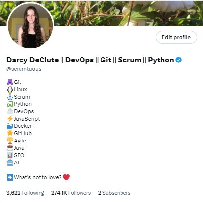

== Foreword

I felt a little nervous when Darcy asked me to write this foreword.

You see, I'm not the biggest Scrum Master cheerleader in the world.

In fact, in many of the Agile transformations I've led, one of our success metrics is how close we come to making the Scrum Master completely unnecessary.

That's not to say I'm against Scrum. I believe Scrum is the right Agile framework to use when starting a new project.

=== The role of the Scrum Master

.Sal Pece, Xennail CEO
image::images/sal.jpg["Sal Pece Xennial CEO",200,200, float="right", align="center"]

I advocate for Scrum, but I also advocate for teams to evolve to such an advanced level of Agile understanding that they don't really need a Scrum Master.

The role of the Scrum Master is to teach, coach, and mentor others in the ways of Scrum, while acting as a leader who serves as the team during an Agile transition.

But here's the thing about transitions: they eventually reach completion.

When an organization truly achieves Agility, the need for a Scrum Master to coach them on cross-functional teams, self-management, and the importance of reviews and retrospectives progressively diminishes. These Agile practices eventually become second nature.

Successful Agile teams don't need coaching on these practices because they naturally incorporate them into their work. It becomes odd for them not to.

=== Measuring Agile Tranformation Success

That's when you know your Agile transformation is a success. That's when you know the team has approached Agile enlightenment.

Of course, you can't do Scrum without a Scrum Master. Scrum without a Scrum Master isn't Scrum.

However, over time, a team's dependence on the Scrum Master should diminish.

At the beginning of an Agile transformation, each development team might require its own dedicated Scrum Master.

Well-coached teams will rely less and less on the Scrum Master for leadership. As Agile transformations succeed, a Scrum Master will divide their time across multiple teams because individual teams become less dependent on their guidance.

Once enlightenment is achieved, a single, underutilized Scrum Master will be shared among multiple teams throughout the organization.

There's a recurring meme in Agile circles that jokes "never asking a Scrum Master what they do," because you'll find out that they don't do much.

I love that meme because it's not only funny but because it should be true if your organization has implemented Scrum correctly.

=== Keeping Scrum Working

On teams where developers and the Product Owner truly understand how Scrum works, the role of the Scrum Master becomes almost ceremonial. If your teams are building amazing products while the Scrum Master is searching for things to do, you're probably implementing Scrum exceptionally well.

And that's why I was nervous about reviewing this book and contributing a foreword.

I was concerned that this Scrum Master Certification Guide would, like most other books about Scrum, overstate the role of the Scrum Master. 

But that nervousness I mentioned earlier quickly turned into enthusiasm as I turned another page of this book.

As I read through the text, I felt Darcy was reflecting my thoughts about effective Scrum back to me. 

Miss DeClute strikes just the right balance between recognizing the importance of the Scrum Master's role within an organization and emphasizing that with highly motivated, self-managed teams, reliance on the Scrum Master accountability should gradually diminish over time.

Darcy gets it right.

Enjoy this certification guide.

It will not only help you pass the Scrum Master certification exam but it will also provide you with a strong understanding of how Scrum _should_ work once an enterprise successfully completes an Agile transformation.

== A Note from the Author

I'm Darcy Declute.

As I write this I'm filled with a mix of conflicting and confusing emotions that range from humility to prive to embarassment to enthusiasm

.At home on native land. Baffin Island, Canada

It's incredibly humbling to me to know that you're reading this book.

If you're reading a book about certification, you're obviously interested in acquiring a Scrum Master certification, which means you're a highly-motivated professional intent on learning, resume building and career advancement.

And you've put our faith in me to guide you on a learning journey. That's humbling.

As overwhelming as it is to know you've put your faith in me, I'm equally proud of the book I've written here. 

I think this book delivers on what it promises. I think this book will play a key role in getting you past the post when it comes time to sit for the Scrum Master certification exam.

A number of students have read this book and then passed the Scrum Master exam, with a few even garnering a perfect score. I know this book played a key role in their success and I'm confident it will play a key role in your success as well. That makes me beam with pride.

=== So many people to thank...

I'm also embarassed when I see this book with my name on the cover, because I feel like an imposter taking credit for this.

When I mentioned to some of my peers and mentors that I wanted to write a Scrum Master certification guide to fill what I thought was a void in the market, my friends encouraged and inspired me.

Some friends on Twitter donated their own free time to proofread, edit, criticize and add corrections.

Other friends add paragraphs and extended the text when they thought a chapter was light or a topic needed clarification.

Other people helped to generate images with MidJourney promps and fixed issues with my book cover.

So when I see my name on the front cover of this book, I feel as though I'm stealing credit, because this was completely a team effort. 

I can't help the people who helped me get this book past the finish line enough. I love all of you.

=== I'm @Scrumtuous everywhere!

.Please come find me on Twitter. I'm @Scrumtuous!

This book is self-published.

There's an old saying that say the biggest problem with self-published books is the person who publishes them. Having read some really low-quality self-published tripe in my life, I don't completely disagree with that sentiment.

However, since I do self-publish, I have the benefit of being able to make updates and changes at a moments notice.

If you do find something in this book that is unclear, missspellled, confusing or even incorrect, please find me on Twitter or LinkedIn and let me know. I'm @Scrumtuous everywhere.

Or better yet, just email me:

darcydeclute@gmail.come

As I mentioned before, people have put a lot of faith in me to help them get certified and drive their career forward. I want to do everything I can to make that possible. Any help you can provide would be apprecaited not only by me, but by everone who reads this book.

Oh, and one last thing. If you do enjoy the book, please leave a 5-star review on Amazon. It would not only put a giant smile on my fact, but it would also help to get this book in front of other people who need it.

Thanks again for reading this book. I really hope you enjoy it. 

Love Darcy. 

