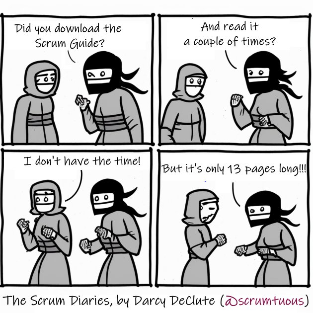
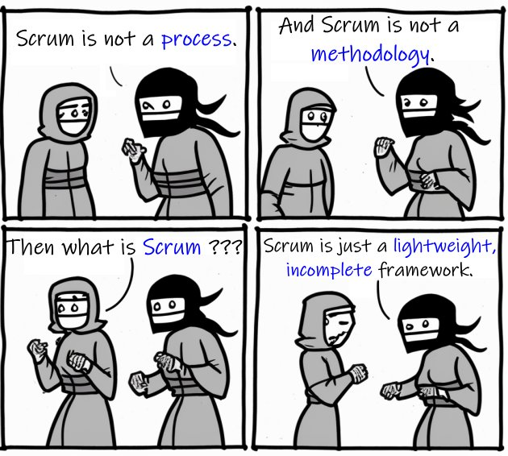

== Chapter 0: Getting Started

I’m going to get you Scrum Certified. I hope you’re ready. 

The process is going to go something like this:

 - We're going to go through the entire 2020 Scrum Guide together, one line at a time
 - Together we'll extract as much meaning as possible out of the Scrum Guide’s words
 - We'll discuss how ideas in the Scrum Guide translate into exam questions
 - We'll iteratively and incrementally test you on what you’ve learned

When you’ve finished this book, my goal is for you to be 100% ready to schedule and pass the exam.

.Download and read the official Scrum Guide a few times before reading this book. Read it a few times after reading this book too. The Scrum Guide is the sole source of truth for any Scrum Certification exam.

=== Forget Everything You Know

If you've ever worked with Scrum in a professional setting and you want to ace the Scrum Master certification exam, the first thing you need to do is forget everything you think you know about Scrum.

- Forget about use cases.
- Forget about story points.
- Forget about poker planning.
- Forget about daily standups.

These concepts have nothing to do with Scrum.

They are never mentioned in the Scrum Guide, and references to them on the certification exam are only there to distract you and trick unprepared test-takers into selecting incorrect answers.

On the Professional Scrum Master certification exam, you'll be tested almost exclusively on concepts within the Scrum Guide. If it's not in the Scrum Guide, it's likely not a correct answer on the certification exam.

The definitive source of truth regarding Scrum comes exclusively from the Scrum Guide. That's what we'll cover in-depth during this guide.

=== So what is Scrum?

(((what is Scrum?)))
Scrum is a lightweight, incomplete framework that helps development teams get started and keep going.

- Does someone have a product vision?(((Product vision)))
- Do you have a team of developers who are anxious to get building?

If that's the case, Scrum says you should start a development Sprint right now.

- Don't waste a lot of time planning because your plans are going to change.

- Don't waste a lot of time designing because your initial designs might not work.

Instead, start developing. Start a development Sprint now. 

A development sprint is a short period of time in which developers focus on building a few important features that will become part of the final product.

A development Sprint can never last more than a month. Make them shorter if you want to minimize risk.

<<<

=== Do a little planning. Do a lot of building. (((planning)))

As I said before, teams shouldn't waste a lot of time planning. However, Scrum doesn't say teams shouldn't plan at all. The very first thing a Scrum Team does when their development Sprint starts is plan.

Not too much time should be spent planning. Never more than 8 hours, and never plan too far into the future. The further you look into the future, the wider the cone of uncertainty becomes. That's why short Sprints are often better than long ones.

During Sprint Planning, the developers talk to the Product Owner about what to build. The Product Owner is the person on the Scrum Team who has the product vision and knows what stakeholders want.

The Product Owner also has an ordered list of features that need to get developed. That's called the Product Backlog.

During planning, Scrum Developers select Product Backlog items they think they can complete before the end of the Sprint.

At the end of Sprint Planning, the developers walk away with:

- A list of features they are going to work hard to complete.
- A plan to get those features finished.
- An overarching Sprint Goal that keeps the team focused.

Then the work begins!
(((standup meeting))) (((status meeting)))
Every workday, the developers meet for a few minutes in something called a Daily Scrum.

- It's not a standup meeting.
- It's not a status meeting.
- The Product Owner and the Scrum Master aren't even supposed to participate.

It's just a chance for the developers to quickly catch up and get the ball rolling again, nothing more.

=== Incremental Progress Over Time

Every Sprint has to create something useful.

Every Sprint must create something that will become part of the final product.

In Scrum, we call that an Increment. Products get built incrementally.

At the end of the Sprint, there's a Sprint Review where the Scrum Team gives stakeholders a chance to play around with the new features. 

Stakeholders are only shown features that are done - not partially done or almost done, but done.

Technically speaking, stakeholders are shown features that meet the "Definition of Done," which is a quality standard everyone on the project has agreed upon.

=== Review and Reflect

Product reviews at the end of every Sprint ensure stakeholders get to see what's being developed at least once every month. It keeps everyone in the loop. Feedback loops are an essential part of Scrum.

After the Sprint Review, the Scrum Team holds a Sprint Retrospective where they discuss what worked and what they need to do better.

When the Sprint Retrospective ends, a new Sprint begins, which means another short planning meeting, daily Scrums, and finally a Sprint Review and Retrospective.

That's why Scrum is said to be iterative. You just keep doing Sprints until the work is done.

And that's Scrum.

It's a simple framework that says:

- Plan, but don't plan too much.

- Work hard at a sustainable pace to develop something usable and valuable.

- Regularly review your work with stakeholders.

- And regularly take time to talk about team dynamics and how to improve things.

And all of this is accomplished by a team that is made up of:

- One Product Owner who defines the Product Goal and manages the product backlog.
- The developers who know how to build the product.
- One Scrum Master, who doesn't do much.

=== The Scrum Master

As Sal Pece said in the foreword, that's sort of an ongoing joke in Scrum - that the Scrum Master doesn't do anything. But the fact is, on a really well-run team, a Scrum Master doesn't have much to do.

The Scrum Master just makes sure Scrum is applied properly.

- They don't manage the team.
- They don't manage the project.
- They don't schedule Zoom calls.
- They don't book conference rooms.
- They don't manage finances.
- They don't update JIRA tickets. (((scrum master))) (((jira)))

They just coach teams and organizations on how to properly apply the Scrum framework while behaving as a leader who serves the team. That's the Scrum Master's job.

Scrum describes itself as a simple, lean, incomplete framework, and that's a good description.

Scrum just describes the best practices any team should be doing if they want to work efficiently and effectively.

It may not work for everyone, but everyone should at least give it a try.

=== Get The Scrum Guide (((scrum guide)))

That's my quick description of Scrum, and I think it's a good one. 

Having said that, the Scrum Master certification exam doesn't test you on what I think Scrum is all about, it tests you on what the Scrum Guide says Scrum is all about, which is why I want you to download and print out a couple of copies of the 2020 Scrum Guide.

The Scrum Guide is only 13 pages long, and that includes the cover page, introduction and the table of contents. You won't be destroying a forest by having a couple of printed copies by your side.

.Try to hit as many learning modalities as you can whenever you learn something new.

Grab a highlighter as well and markup that printed copy as we go along. It'll help you learn.

=== Read the Scrum Guide

Along with downloading it, you should also _read_ the Scrum Guide before you dig into the first chapter of this book. In fact, read it a couple of times. That way you'll have a better idea of what phrases like _the Sprint Goal_ and _a usable Increment_ mean.

With that foundation, we'll be able to dig much deeper into the significance of these interesting and important terms. 

Now let's get started with the Scrum Guide!

<<<
== Chapter 1: What is Scrum?  (((definition of scrum)))

How would you define Scrum?

To be successful on the Scrum Master certification exam you have to commit to the Scrum Guide's definition of Scrum, which means abandoning the biases and misconceptions you may have adopted over years of seeing Scrum implemented in a less than pure manner.

Here's the 2020 Scrum Guide's first sentence. How well does this definition of Scrum work with the way you previously perceived it? (And I say 'previously', because this is the definition you must 100% commit to right now if you want to pass the Scrum Master certification exam.)

[quote, 2020 Scrum Guide page 3]
____
Scrum is a lightweight framework that helps people, teams and organizations generate value through adaptive solutions for complex problems. 
____

Given what you know about Scrum, and taking into account any experiences you've had with Agile development, how would you rate this definition?

.Scrum is a lightweight, incomplete framework that helps teams solve complex problems as they work towards a Product Goal. Scrum advocates downplay the terms 'process' and 'methodology.'

<<<

=== The Definition of Scrum 

Whoever crafted that definition tried to make it as general and all-encompassing as possible, almost to the point where the definition doesn't provide much value. (((complex problems)))

- The term 'generate value' is very generic
- The term 'complex problems' could apply to anything
- The term 'adaptive solutions' sounds like marketing gibberish

But this is the definition we have, and this is the definition you will be tested on.

==== The Words Not Spoken 

The Scrum Guide say a lot in its brief 13 pages, but sometimes it's more interesting to focus on what the Scrum Guide _doesn't_ say. Notice how: (((process))) (((methodology)))

- The official definition of Scrum never mentions software development
- The official definition calls Scrum a _framework,_ not a process or methodology

Given the official definition of Scrum, how would you answer the following question?

'''

==== Test Yourself

****
Scrum is a proven software development process.

* [ ] True
* [ ] False

****

The answer is false. Scrum is not a process, nor does it specifically target software development.

You'll get beaten with a stick if any of the Scrum gatekeepers ever hear you call Scrum a process or a methodology. Scrum is a lightweight, incomplete framework. 

- Scrum is not a process.
- Scrum is not a methodology.
- Scrum is purposefully incomplete.

Scrum doesn't try to solve all of your project management problems. It just helps you to get started, to keep going and to minimize risks along the way.

NOTE: While the authors of the Scrum Guide both signed the Agile Manifesto, the word _Agile_ never appears once in the 2020 Scrum Guide.

<<<

=== Scrum is a Framework (((framework)))

Feel free to debate whether you believe Scrum is a process or a methodology on Twitter or in your favorite online forum. I know I have. On the Scrum Certification exam? Scrum is a framework.

The stewards of the Scrum framework have also worked hard to position Scrum as a tool that can be applied in a variety of industries, not just software development. 

If you ever see an option on the certification exam that asserts Scrum works exclusively in the domain of software development, avoid it, because it's wrong.

'''

==== Test Yourself (((lightweight)))

Here's the type of trick question you'll see on the Scrum certification exam that attempts to trip you up on the incorrectly held belief that Scrum is only used in software development:

****
Scrum is a lightweight framework used exclusively by software development teams to generate value through adaptive solutions to complex problems. 

* [ ] True
* [ ] False

****

The answer is false because the question implies that Scrum is only applicable in the world of software development. 

There is a big push in the Scrum community to gain acceptance outside of software development. Any certification questions that pigeonhole Scrum into a software development box will be wrong.

'''

==== Test Yourself

****

Which one of the following statements most accurately reflects the definition of Scrum?

* [ ] A) Scrum is a software development methodology
* [ ] B) Scrum is an Agile process for teams and organizations to follow
* [ ] C) Scrum is a lightweight framework to help teams tackle complex problems
* [ ] D) Scrum is a lightweight framework to help teams and organizations build software

****

Option C is correct. 

The Guide describes Scrum as a "lightweight framework that helps people, teams, and organizations generate value through adaptive solutions for complex problems." Any references to Scrum being a methodology, a process, or a framework that only targets software development will always be a wrong answer on the Scrum Certification exam.

=== Iterative and Incremental (((iterative))) (((incremental)))

According to the Scrum Guide, here's a high-level overview of how Scrum is supposed to work.

[quote, 2020 Scrum Guide page 3]
____
In a nutshell, Scrum requires a Scrum Master to foster an environment where:

. A Product Owner orders the work for a complex problem into a Product Backlog.
. The Scrum Team turns a selection of the work into an Increment of value during a Sprint.
. The Scrum Team and its stakeholders inspect the results and adjust for the next Sprint.
. Repeat
____

=== What's in a name? 

The name 'Scrum Master' sounds intimidating.

People think that since the term 'master' is in the name, the Scrum Master controls everything.

The Scrum Master controls very little. 

The Scrum Master's only real job is to coach people on how Scrum works, or as this paragraph states, 'foster an environment' where this iterative set of steps is performed.

=== Scrum is Simple

People tend to overthink Scrum. 

People think there are a bunch of rules they have to follow if they want to use Scrum. The fact is, there are very few rules in Scrum. The brevity of the Scrum Guide is proof of that.

Scrum is pretty simple, and when problems arise, it's pretty pragmatic too.

[quote, 2020 Scrum Guide page 3]
____
Scrum is simple. 

Try it as is and determine if its philosophy, theory, and structure help to achieve goals and create value. 

The Scrum framework is purposefully incomplete, only defining the parts required to implement Scrum theory. 

Scrum is built upon the collective intelligence of the people using it. 

Rather than provide people with detailed instructions, the rules of Scrum guide their relationships and interactions.
____

==== Test Yourself

****
Which of the following statements are true about the Scrum framework? +
(Choose 2)

* [ ] A) Scrum describes an iterative process
* [ ] B) Scrum is an iterative framework
* [ ] C) Scrum generates value by repeatedly delivering usable increments to the stakeholders
* [ ] D) Scrum only allows stakeholders to inspect progress when the final product is delivered
****
Options B and C are correct.

Scrum describes a set of steps that are to be repeated again and again. That makes Scrum _iterative._ But Scrum's an iterative _framework_, not an iterative _process_. So Option B is correct while Option A isn't.

Scrum is also an incremental framework, which means it constantly tries to deliver something tangible and of value to the client at the end of every sprint. That way the stakeholders can regularly give feedback. If there's an issue, the Scrum Team can then adapt.

That's in stark contrast to what is known as the Waterfall model where the client gets a complete product at the end of a long development cycle. So Option C is correct while Option D is wrong.

=== It's a Guide. It's not an Instruction Manual (((guide))) (((manual)))

People often look to the Scrum Guide for definitive answers to things. The Scrum Guide doesn't contain many definitive answers.

It's a guide, not a rulebook.

The Scrum Guide even promises __not__ to be heavy on rules, saying that it promises _not_ to 'provide people with detailed instructions.'

There are very few actual rules in the 13-page Scrum Guide. Outside of the few rules Scrum does have, the framework encourages people to discover strategies that work best for them.

TIP: It often helps to think about certification exam questions outside of the domain of software development. Reframe an exam question in terms of an isolated team building a shelter on a deserted island and answers may become more clear.

==== Test Yourself

****
Scrum is a complete and proven framework that helps teams achieve goals and create value.

* [ ] True
* [ ] False

****

This is false. Scrum self-identifies as a _purposefully incomplete_ framework.

This fact seems counter-intuitive to many. After all:

- Why would anyone want to use an incomplete framework? 
- Wouldn't a complete framework be better?

The incomplete nature of Scrum is actually what makes it so attractive. Scrum provides only enough direction to be useful, but not so much direction that it is restrictive. Scrum teams are given all the leeway they need to find the processes and frameworks that work best for them.

<<<

=== Exposing Efficacy (((efficacy)))

One of the funny things about Scrum is that because it's so simple, it can expose practices and processes that are wasteful and non-productive. It also allows developers to focus on the practices that make them most productive.

[quote, 2020 Scrum Guide page 3]
____
Various processes, techniques, and methods can be employed within the framework. 

Scrum wraps around existing practices or renders them unnecessary. 

Scrum makes visible the relative efficacy of current management, environment, and work techniques so that improvements can be made.
____

Since Scrum is a framework, not a process, other processes can be used within it.

=== Combine the Scrum Framework with other Processes

For example, people often think Kanban is a competitor to Scrum, but there is nothing that says Scrum and Kanban can't be used together.

If you're not familiar with Kanban, don't worry. Kanban is never mentioned in the Scrum Guide, and for the Scrum Master certification exam, all you need to know is that it's an alternate development strategy.

==== Test Yourself (((kanban))) (((lean)))

****
Scrum can be used alongside various processes and methodologies including Kanban and Lean.

* [ ] True
* [ ] False

****

This is true.

Scrum is not a process nor is it a methodology, and because of that, it can be used in conjunction with a variety of popular methodologies like Kanban and Lean.

The Scrum Certification Exam will not test you on the intricacies of Lean Manufacturing or Kanban. It's sufficient just to know that these are two processes commonly used in manufacturing and software development.

'''

TIP: Waterfall gets its name from the fact that isolated development phases like planning and design flow into each other, in only one direction, just like water in a waterfall.

<<<

==== Test Yourself

****
When implemented properly, Scrum has the capacity to expose ineffective management.

* [ ] True
* [ ] False

****

This is true. 

The iterative and incremental nature of Scrum, where constant inspection and adaptation is encouraged, will shine a light on ineffective practices that happen external to the Scrum Team. 

That's what the Scrum Guide means when it says "Scrum makes visible the relative efficacy of current management, environment, and work techniques so that improvements can be made."

And with that question answered, we're done with the definition of Scrum. 

Now on to a little overview of what Scrum theory is and what it's based on.

