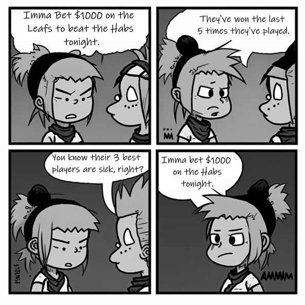
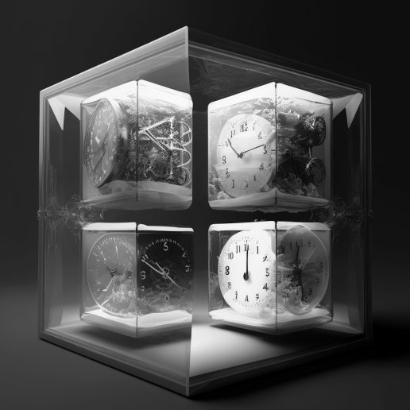
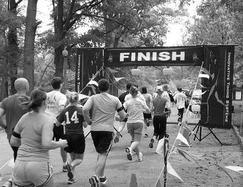

== Chapter 2: Scrum Theory

Scrum boasts of being built around the concepts of 'empiricism and lean thinking.'

The subject of 'Empiricism' is one of the 13 groups into which questions on the Scrum Master certification exam are categorized, so pay special attention to the concept.

[quote, 2020 Scrum Guide page 3]
____
Scrum is founded on empiricism and lean thinking. 

Empiricism asserts that knowledge comes from experience and making decisions based on what is observed. 

Lean thinking reduces waste and focuses on the essentials.
____

I'm not a big fan of the word empiricism.

Fundamentally, empiricism means using your five senses to understand the situation you're in. I'm not sure how my sense of smell or taste helps me as a Scrum Master.

In the context of Scrum, empiricism means understanding the situation you are in based on knowledge, experience, and verifiable facts.

Empiricism also ties in tightly with the Scrum Pillars of transparency, inspection, and adaptation. That is, if you can see exactly what is happening (transparency), you can honestly assess your progress (inspection) and based on this real knowledge, you can adapt. 

Empirical analysis of your current situation is a more effective way to make decisions than following a plan written up six months ago, or making decisions based on trendlines on a historical chart.

TIP: The word _empiric_ is Latin meaning 'based on observations formed during medical treatments.' The _piric_ part of _empiric_ is Latin for 'trial or test.'

=== Empirical Example

Here's an example of the application of empiricism.

Imagine you have a burndown chart that says you are completing 10 items Sprint. How many items do you think you'll complete in the next Sprint?

You'd probably say 10, but that's an answer based on a chart. Charts don't have five senses. Charts may be predictive, but they're not empirical.

Now, say you know half the developers have taken time-off to be with their families during the next Sprint?

You'll probably reduce your projection by 50 percent. That decision is based on empirical evidence that a chart simply couldn't provide.

<<<

=== Lean Thinking

Lean thinking is also an important concept in Scrum. 

The idea of lean thinking comes from productivity enhancements Toyota discovered in the 1950s and 60s. Obviously Toyota was building cars, but the lessons of lean thinking are universal to all product development domains.

Key concepts of lean manufacturing that manifest themselves in the Scrum framework include:

- The idea that all unnecessary steps in a process should be eliminated
- The belief that all work should be tied tightly to a specific outcome or goal
- The insistence that products should not be over-engineered with unnecessary features
- The need for a direct connection with the customer or stakeholder
- The insistence that teams have strong leaders whose priority is to serve their team
- The desire for workers not to be left idle during the production process
- The fact that improvements should be made in accordance with empirical observations

Just looking at this list you can see how:

- The Scrum Master role maps to the lean demand that teams have strong leaders
- The Sprint and Product Goals map to the idea that work should be tied to a specific outcome
- Scrum's Sprint Review embraces the ideas of maintaining a tight connection with the stakeholder

Avoid waste and embrace minimalist thinking when you're working on a Scrum project. That's _lean thinking._

=== Empiricism and Lean Thinking

You are guaranteed to get five or six questions from this section on the Scrum Master certification exam. They are easy marks if you just understand what 'empiricism' and 'lean thinking' means.

==== Test Yourself

****
Scrum theory emphasizes empiricism. That means a decision made by Scrum teams: +
(Choose 3)

* [ ] A) Should be based on factual evidence
* [ ] B) Should be based on intelligent assumptions
* [ ] C) Should be based on verifiable observations
* [ ] D) Should be driven by pragmatic speculation
* [ ] E) Should be based on experience

****

Options A, C, and E are correct.

Empiricism is all about using your experience, your gained knowledge, and verifiable observations (which is sorta the same as 'experience') to make decisions.

Concepts like 'speculation' and 'assumptions' run counter to the concept of empiricism, even if the speculation and assumptions are pragmatic and intelligent.

[quote, TechTarget WhatIs Definition, Empiricism]
____

"In empiricism, knowledge is spoken of as a posteriori, or "from the latter," meaning gained from experience. Simply put, empiricism is the idea that all learning comes from only experience and observations.

The term empiricism comes from the Greek word for experience: empeiria. The theory of empiricism attempts to explain how human beings acquire knowledge and improve their conceptual understanding of the world."
____

'''

.Charts and trends are no replacement for first-hand knowledge and empiricism.

==== Test Yourself

****

Which of the following are characteristics of lean thinking? +
(Choose 2)

* [ ] A) A focus on waste reduction and efficiency
* [ ] B) A command and control approach to problem-solving
* [ ] C) A minimalist approach that removes unnecessary steps
* [ ] D) A methodology that is made up of individualized, compartmental steps that flow into each other.

****

In this case, A and C are correct.

Efficiency, waste reduction, and the elimination of unnecessary steps within a process are all hallmarks of lean thinking.

The old Scrum Guide use to talk about the importance of _servant leadership._ That's still important, but it's been rephrased in the 2020 Scrum Guide. Now we talk about 'leaders who serve.'

The 'Command and Control' approach that the military takes is the opposite of 'servant leadership,' so option B is incorrect.

The last option describes the Waterfall methodology, which is the antithesis of the Scrum framework.

Empiricism and lean thinking lay the foundation for the Scrum Framework. Be comfortable with these two terms and understand their basic meaning to score a few easy marks on the Scrum Master certification exam.

=== Predictability and Risk

[quote, 2020 Scrum Guide page 3]
____
Scrum employs an iterative, incremental approach to optimize predictability and control risk.
____

This one sentence is a lot to unpack. 

Scrum is iterative because it describes a set of steps that get repeated over and over again. The iterative sequence of steps as outlined in the first section of the Scrum Guide are:

1. A Product Owner orders the work for a complex problem into a Product Backlog.
2. The Scrum Team turns a selection of the work into an Increment of value during a Sprint.
3. The Scrum Team and its stakeholders inspect the results and adjust for the next Sprint.
4. Repeat

Scrum is incremental. That's referenced in the second step of the iterative process:

"The Scrum Team turns a selection of the work into an Increment of value during a Sprint."

The idea of Scrum being incremental means that small victories, small units of value, and small pieces of the final product get created and added together slowly over time until the product is finally finished. 

Piece by piece, through the delivery of value added upon value, the product gets built. That's the incremental process.

By getting these small increments into the hands of stakeholders, and getting immediate feedback from which the Scrum Team can adapt, Scrum reduces risk and allows developers to better service the needs of their clients.

=== Cross-Functional Teams

The idea that teams should be cross-functional and self-managed is a key concept in Scrum, and it's one that you'll be tested on multiple times when you sit for the Scrum Certification exam.

[quote, 2020 Scrum Guide page 3]
____
Scrum engages groups of people who collectively have all the skills and expertise to do the work and share or acquire such skills as needed.
____

This is another extremely loaded statement. Understanding this paragraph will go a long way towards properly answering some of the most challenging questions on the Scrum Master certification exam.

Scrum assumes that the Scrum Team has all the skills required to build the product being developed.

- Does your project need testers? Then those people are on the Scrum team.
- Does your project need an architect? That person is on the Scrum team.
- Does your project need a performance or security specialist? Then a person with those skills must be on the Scrum team.

And what if your Scrum team doesn't have those skills? Then your team acquires them.

==== Test Yourself

****
One of the items under development as part of your project is a spaceship to Mars, but nobody on your team knows how to build a spaceship to Mars. 

Which one of the following options is the best way for the team to move forward?

* [ ] A) Outsource the development of a spaceship to a third party
* [ ] B) Remove the development of a spaceship from the project's requirements
* [ ] C) Explain to the Product Owner that you don't have the skills to build a spaceship to Mars
* [ ] D) Get the team to start learning about how to build a spaceship to Mars
****
Option D is correct.

This question is silly to the extreme, but it makes a point. 

According to Scrum, all of the skills required to build a project under development exist on your team, or your team will take it upon themselves to acquire the skills needed. If your team outsources work to a third party, then the work in question is no longer within the control of the team, which means it's no longer part of the Scrum process. 

That's what the Scrum Guide means when it says "Scrum engages groups of people who collectively have all the skills and expertise to do the work and share or acquire such skills as needed."

==== The All-Encompassing Sprint

[quote, 2020 Scrum Guide page 3]
____
Scrum combines four formal events for inspection and adaptation within a containing event, the Sprint.
____

This statement is the source of the most commonly asked trick questions on the Scrum Certification exam, which are:

- Which events happen after the Sprint finishes?
- Which events happen before a Sprint begins?
- When a Sprint ends, when does the next Sprint begin?

Scrum has four time-boxed events that happen within a fifth Scrum event known as a Sprint. Sprint Planning, the Daily Scrum, the Sprint Review, and the Sprint Retrospective all happen within the confines of a Sprint.

- None of the Scrum events happen after a Sprint
- None of the Scrum events happen before a Sprint.
- None of the Scrum events can be left out of a Sprint.

=== Moving from Sprint to Sprint

Everything in Scrum happens within the boundaries of a Sprint. As soon as one Sprint ends, the next Sprint begins. 

There is no buffer time between when one Sprint ends and the next Sprint starts where integration takes place, quality assurance happens or testing is done. If any of those things are part of the development of your product, all of those things have to happen during the Sprint.

Don't get tripped up on any questions that ask what happens before or after a Sprint. 

==== Inspection and Adaption

Notice how the Scrum Guide states that the higher purpose of the different Scrum Events, such as the Review, Retrospective, Planning meeting, and the Daily Scrum is to 'inspect and adapt.'

.The four timeboxed events in Scrum all occur inside a fifth event known as the Sprint.

[quote, 2020 Scrum Guide page 3]
____
Scrum combines four formal events for inspection and adaptation within a containing event, the Sprint.
____

You will often get questions on the Scrum certification exam about what the purpose of the Sprint Retrospective is or what the purpose of the Daily Scrum is. If any of the listed options include the terms 'inspect' or 'adapt', those will likely be the correct answers.

==== Test Yourself
 
****
Which one of the following options best describes when a new Sprint begins?

* [ ] A) A new Sprint begins when Sprint Planning is completed
* [ ] B) A new Sprint begins when the Sprint Review is completed
* [ ] C) A new Sprint begins when the Product Owner begins the Sprint in JIRA
* [ ] D) A new Sprint begins after Sprint Planning when the Scrum Master declares the start of the Sprint
* [ ] E) A new Sprint begins as soon as the previous Sprint ends
****

Option E is correct. A new Sprint begins as soon as the previous Sprint ends.

Technically speaking, the last event in the Sprint is the Sprint Retrospective, and the end of this event officially marks the end of the Sprint. 

If we were to temporarily jump ahead 7 pages in the Scrum Guide, we'd see that stated in plain text.

[quote, 2020 Scrum Guide page 10]
____
The Sprint Retrospective concludes the Sprint.
____

==== Test Yourself

****
What is the purpose of the Daily Scrum? + 
(Choose 2)

* [ ] A) For the Scrum Master to get daily status updates from the developers
* [ ] B) To allow the developers to inspect their progress toward the Sprint Goal
* [ ] C) For the Product Owner to track the development team's progress on Product Backlog items
* [ ] D) To allow the developers to adapt their Sprint Plan as they work towards the Sprint Goal
****

Options B and D are correct.

From day to day and hour to hour, conditions change. 

Scrum recognizes this reality, which is why it provides several events that allow for the inspection of progress along with the ability to adapt if necessary.

It should be noted that inspection and adaptation can happen at any time during the Sprint, not just during the official Scrum events. 

If a computer hosting the Git repo catches fire, you don't wait until tomorrow's Daily Scrum to put it out, nor would you wait to tell the rest of the team about it. 

'''

=== A Word About Being Lean

One of the early reviewers of this book pointed out that while I go deeply into the topic of empiricism in this chapter, my coverage of lean is, well, _lean_.

There's a reason for that.

The fact is, on the Scrum Master certification, _empiricism_ is one of the 13 categories in which questions are categorized. You can expect 5 or 6 exam questions that hit the topic of empiricism in several different ways. You won't see many exam questions on lean manufacturing, and the ones you will see will look like this:

==== Test Yourself

****
Which of the following concepts are consistent with a lean approach to product development? + 
(Choose 3)

* [ ] A) The elimination of unnecessary steps in a process
* [ ] B) Isolated development phases that flow into each other
* [ ] C) The removal of unnecessary features in a product
* [ ] D) Significant up-front planning and design
* [ ] E) The elimination of idle time where developers are not working
****

Options A, C and are E are correct.

These three options are core concepts learned from _lean manufacturing._

Options B and D represent the waterfall model, which is the antithesis of Scrum and lean.

'''

=== Lean Learning with a Focus on Scrum Master Certification

There are many topics I _could_ go in depth on in this book, but my preference is to keep you focused on what the test covers, not simply what I find interesting. That's why I don't go too heavy into the topic of lean thinking.

That's also why you'll often find me repeating myself about certain topics throughout the book. For example:

- I will annoyingly repeat myself about the time allotted to the various Scrum events.
- I constantly emphasize that you don't have to wait for a Scrum event to change your plan.
- Scrum is a framework, it's not a process or a methodology.
- Scrum is not just for software development but for the development of _any product_.

The Scrum Guide never mentions the word _Agile_ and it never talks about _user stories_ or _story points._ 

Furthermore, the Scrum Master exam never tests you on these concepts, and whenever a potential answer references a _user story_ or a _story point_, those answers will be red herrings trying to trip you up and get you to select an incorrect option.

NOTE: A _red herring_ is something that misleads or distracts. The term comes from a story where a strong-smelling fish was used to distract dogs chasing a lovable rabbit.

Part of passing the Scrum Master certification exam is to first forget everything you _think_ you know about Scrum, and then focus on the core concepts contained within the Scrum Guide.

My goal is to get you Scrum Master certified. A _lean approach_ to doing so is to not waste your time discussing peripheral topics that will distract and confuse you.

One of the Scrum values is focus. 

Imma try my very best to keep you focused, not waste your time on topics that aren't heavily tested on the exam, and at the same time, constantly re-inforce topics that I know will be tested heavily. 

That's how we're going to get you past the Scrum Master certification finish line!

.With lean thinking and focus, we're going to get you past the Scrum Master certification finish line. (Image: Joshbdork, GFDL1.2)

