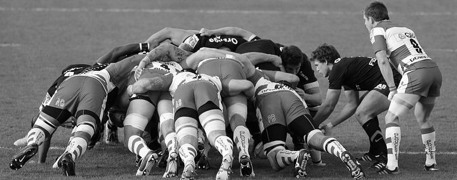

== Chapter 4: Scrum Teams

Two of the thirteen categories into which Scrum Certification exam questions are grouped include:

- Scrum Teams
- Self-Managing Teams

Pay close attention to how Scrum Teams are structured, the role self-management and self-organization has, and avoid clouding the simple approach Scrum takes to team dynamics with what you may have learned in environments where Scrum may not have been applied properly.

=== Composition of a Scrum Team

[quote, 2020 Scrum Guide page 5]
____
The fundamental unit of Scrum is a small team of people, a Scrum Team. 

The Scrum Team consists of one Scrum Master, one Product Owner, and Developers.
____

Take note of the fact that a Scrum team is made up of three _things:_ one Scrum Master, one Product Owner, and multiple Developers.

Notice how I called them 'things.' 

People like to call them 'roles.' The Scrum Guide never uses the term 'role' once. Technically, these are not roles. 

The Scrum Guide later refers to them as 'accountabilities.' They are technically not 'roles.'

.A Scrum Teams has one Product Owner, one Scrum Master and developers. What does your Scrum Team look like?

==== Test Yourself

Here's a typical Scrum Certification exam question that tests your knowledge of the proper structure of a Scrum Team. 

****
Which one of the following best describes the typical composition of a Scrum Team?

* [ ] A) A Scrum Team is made up of one Scrum Master, many Product Owners, and many Developers
* [ ] B) A Scrum Team is made up of one Scrum Master, one Product Owner, and many Developers
* [ ] C) A Scrum Team is made up of many Scrum Masters, many Project Managers, and many Developers
* [ ] D) A Scrum Team is made up of one Scrum Master, one Project Manager, one Product Owner, and many Developers
****

The answer is B. 

A Scrum Team is made up of one Scrum Master, one Product Owner, and many Developers

You will often see the term _Project Manager_ appear in certification questions to throw you off. There is no _Project Manager_ in Scrum. There is a Product Owner, but there is no such thing as a Project Manager in Scrum.

There are also no:

- Testers 
- Architects
- Engineers
- Plumbers
- Carpenters
- Rocket Scientists or
- Hairdressers referenced in the Scrum Guide. 

If people with those skills are required to build the product you're working on, then they all fall under the term 'Developer.' There are no separate _Quality Assurance (QA)_ people or _Business Analysts_ in Scrum. There are no separate testing teams. 

If your project needs testers, blacksmiths, or QA people, then they are considered developers on the team.

If you ever see references to _Quality Assurance Teams_ or _Project Managers_ or _Tester_ roles as options on the Scrum Master certification exam, those options are typically incorrect.

<<<

==== Test Yourself 

****

The software developers on the Scrum Team are frustrated that their time is being consumed by tasks like user documentation and user acceptance testing. They would prefer to concentrate on core development activities.

Which one of the following options best describes how a team of software developers should operate under the Scrum framework? (Choose 1)

* [ ] A) Software developers should do as much development as they can and then pass quality control work off to QA people.
* [ ] B) Software developers should only build core features and then allow others to take care of non-functional aspects.
* [ ] C) Software developers should outsource work they are not skilled to perform to third parties or external teams.
* [ ] D) All work should be completed by the developers on a Scrum Team, including testing and documentation.
****

Option D is correct.

This question is a typical example of a Scrum Master certification question describing how many software development teams who say they are doing Scrum behave in an attempt to get you to incorrectly answer the question.

Many Scrum Master certification exam questions will talk about professions like QAs, business analysts, or engineers who are not on the Scrum team. Anyone doing work as part of product development must be _on_ a Scrum Team. Regardless of what their skills are, they are simply seen as a Developer in the eyes of the Scrum Guide.

Options on the Scrum Certification exam where they start talking about specific professions are usually wrong because a Scrum Team only has three accountabilities: one Scrum Master, one Product Owner, and Scrum Developers.

'''

=== Subteams are Radioactive in Scrum

In Scrum, the development team is a collection of 'equals', regardless of their skills or experience.

In Scrum Team, there are no separate 'QA Teams' or 'Testing Teams', nor is there even a team lead. 

Everyone pitches in to do the required work, and with the team's cross-functional skills, they can accomplish any specified testing or QA requirements.

[quote, 2020 Scrum Guide page 5]
____
Within a Scrum Team, there are no subteams or hierarchies. It is a cohesive unit of professionals focused on one objective at a time, the Product Goal.
____

The topic of subteams and hierarchies will be at the heart of seven or eight questions on the 80 question Scrum Master certification exam. They're easy to get right if you just remember that there are no sub-teams and there are no hierarchies in Scrum.

What does it mean to say there are no subteams in Scrum?

- It means there is no QA team to check for quality issues. The development team does that.

- It means there is no testing team to check for bugs. The development team does that.

- It means here is no performance team to do load testing. The development team does that.

If bugs need to be fixed, if quality needs to be assured, or if performance needs to be tested, then the people doing that work are part of the development team. To be without hierarchies means developers aren't given titles like 'Team Lead' or 'Sr. Developer.' Everyone on the team is equal. 

.The only time you have a subteam in Scrum is if there is literally a team of developers working on a sub. (Credit: USS Albacore, US Navy)
image::images/subteam.jpg["The only time you have a subteam in Scrum is if there is literally a team of developers working on a sub. (USS Albacore, credit: US Navy)"]

==== Test Yourself

Here's the structure of a prototypical Scrum Master certification exam question that tests you on hierarchies and subteams:

****
There is an issue. What should you do? (Choose 1)

* [ ] A) Talk to the Senior Developer on the Scrum Team about it
* [ ] B) Talk to someone on the QA team about it
* [ ] C) Talk to someone on the testing team about it
* [ ] D) Coach the developers around strategies of how to address it as a team

****

Option D is correct.

You should immediately identify the first three options as being wrong because they talk about a Senior Developer (hierarchy), a QA team (subteam) and a testing team (subteam). 

Scrum doesn't have subteams or hierarchies. If there's ever an issue that falls on the shoulders of the Scrum Master to solve, the solution is typically for the Scrum Master coach around it.

<<<

<<<
 
=== Cross-functional Scrum Teams

The importance of the concept of cross-functional teams that can accomplish everything required of them without resorting to third parties our outsourced help can't be emphasized enough for people who wish to pass the Scrum Certification exam.

[quote, 2020 Scrum Guide page 5]
____
Scrum Teams are cross-functional, meaning the members have all the skills necessary to create value for each Sprint.
____

The cross-functional aspect of a Scrum Team confuses a lot of test takers.

If you bake a cake, you need all the ingredients before you begin, right?

And if you want to build a product, you need a team of developers who have all of the skills needed to build that product.

If your team is going to build, test, secure and load test an application, then your team has to have developers on it with all of those skills.

Does the product under development require a warp drive made from dilithium crystals? Then your cross-functional team better have someone with the skills to build that, or at the very least, they better be actively learning how to do it. 

A Scrum team doesn't outsource their work, nor do they hand their work over to a 'testing team' or a 'quality assurance' team. The Scrum Team itself is cross-functional and capable of doing whatever is required to produce the product under development. That's what it means to be cross-functional.

==== Test Yourself

****
The next feature required by the Product Owner is a Mars orbiter, but nobody on your team knows how to build a Mars orbiter. What should you, the Scrum Master, advise the team to do? (Choose 1)

* [ ] A) Tell the dev team the Mars Orbiter will be removed from the required features list.
* [ ] B) Cancel the Sprint until the team finds someone who can build a Mars orbiter.
* [ ] C) Tell the dev team the Mars Orbiter feature will be outsourced to Elon Musk and SpaceX.
* [ ] D) Coach the dev team on the importance of learning and acquiring the skills required to complete all of the required product features.
****

Option D is correct.

This may sound like a silly question, but what would happen if you were on a team that needed to build a Mars Orbiter?  You'd have to research how to do it and figure it out. And if you were hired to build a Mars Orbiter, the assumption is that you are indeed someone smart enough to figure out how to solve that impossible problem.

=== Cross-Functional and Self-managed

[quote, 2020 Scrum Guide page 5]
____
In Scrum, the developers are assumed to be cross-functional, and as a group, they will possess all of the skills needed to produce the product being built. That's what it means to have a cross-functional team.

Scrum Teams are also self-managing, meaning they internally decide who does what, when, and how.
____

Scrum self-describes as an 'incomplete framework.' That means it doesn't have a lot of rules or requirements.

Scrum practitioners are encouraged to 'find their path' and do what works for them. The developers should be allowed to manage themselves as much as possible.

.A cross-functional Scrum Team has all the skills needed to complete a Product Backlog item from beginning to end. (Credit: Pierre Selim)

==== Test Yourself

****
Your company just hired 50 new developers. How should they be put into teams? (Choose 1)

* [ ] A) Have the Project Manager split them up to create balanced teams based on education, experience, and skill level.
* [ ] B) Have the Scrum Master split them up into evenly divided teams where their skills match their problem domain.
* [ ] C) Have Human Resources split them up into equally divided teams based on their personality types.
* [ ] D) Let the developers split themselves up into any number of groups in any way they like.
****

In this case, option D would be the correct answer. If the teams are truly self-managed, they should be allowed to group in whichever way they see fit. Scrum does limit the size of a team to 10 individuals, so that is the only hard constraint that would be put on the grouping.

<<< 

==== Test Yourself

****
You, the Scrum Master, come to work on the first day of the new Sprint, and you find out from the Product Owner that the 8-member development team has split up into one group of 3, and another group of 5. The Product Owner is worried about how this will impact the project. 

What one option would you, as the Scrum Master, choose?

* [ ] A) Coach the developers on the importance of staying together as a single, cohesive team.
* [ ] B) Explain that groups can't be broken up midway through the development of a product.
* [ ] C) Have Human Resources talk to the developers about making rash, surprise decisions
* [ ] D) Allow the team to split up in whatever way they see fit, and coach the Product Owner on the importance of self-managed teams.
****

Option D is correct.

In this case, the development team wants to split up into two groups. If that's what they want, then let them do it.

The development team is a group of self-motivated, highly motivated individuals with one overarching objective - to achieve the Product Goal. If the developers believe two teams would be more productive, then that's their decision. They get to self-organize in any way they see fit.

'''

==== Test Yourself

Here's another self-management question that often catches test-takers off guard.

****
Who has the right to remove a Developer from a Scrum Team? (Choose 1)

* [ ] A) Human Resources
* [ ] B) The Product Owner
* [ ] C) The Scrum Master
* [ ] D) The Development Team
****
Option D is correct.

Again, the development team is self-managing. If there is a Developer that they believe is best removed from the team, then the Developer should be removed from the team. 

That doesn't mean the Developer should be fired. Maybe they were under-utilized. Or maybe they somehow impeded progress. But if the development team believes that removing an individual from the team would better serve the Product Goal, then that's a decision the team should be allowed to make.

=== Why only 10 to a Scrum team?

The maximum size of a Scrum Team, including the Scrum Master and Product Owner, is 10. Here's why:

[quote, 2020 Scrum Guide page 5]
____
The Scrum Team is small enough to remain nimble and large enough to complete significant work within a Sprint, typically 10 or fewer people. 

In general, we have found that smaller teams communicate better and are more productive.
____

You'll be tested on the maximum size of a Scrum Team: it's 10 or fewer.
That includes the Product Owner and the Scrum Master, so generally speaking, that implies 8 developers. 

However, there are many instances where a Scrum Master or even a Product Owner might be doing development too. This means there might be 10 developers, with two of them playing double-duty as a Scrum Master or Product Owner.

=== Can Developers also be Scrum Masters?

People often wonder if a Scrum Master can also be a Developer, or if a Scrum Master can also be the Product Owner. There's nothing in the Scrum Guide that forbids it, so it's fair dinkum. 

- Is it ideal for the Scrum Master to also be the Product Owner? Probably not. 

- Is it pragmatic for the Scrum Master to also be the Product Owner? Maybe sometimes it is?

If a Product Owner has amazing skills with regards to the development of a Product Backlog item or two, why not allow them to contribute to the Increment? Again, there's nothing in the Scrum Guide that forbids a Product Owner or Scrum Master from doing working on Product Backlog items.

It's nice to think of the Scrum Master and Product Owner as dedicated roles. But on small startups, where there may only be five people in the entire company, you may have all of them doing some sort of development during a Sprint. In that case, the person who took on the Scrum Master accountability also takes on accountabilities as a Developer. 

There's absolutely nothing in the Scrum Guide that says a Scrum Master can't also do development, and pragmatically speaking, for many small companies, it's a reality. But regardless of how many people are wearing multiple hats, the total number of people on a Scrum Team should be 10 or less.

.One person may wear different hats and assume multiple roles on a Scrum Team.

<<<

==== Test Yourself

****
What is the optimal size of a Scrum team? (Choose 1)

* [ ] A) 3-9 people
* [ ] B) 7 plus or minus 2
* [ ] C) 10 people or less
* [ ] D) Scrum lets self-managed teams determine their own size
****

Option C is correct.

Normally, Scrum allows self-managed teams to decide what is best for them. But when it comes to team size, Scrum recommends teams are made up of 10 people or less. I believe SAFe uses 7 plus or minus 2 as the team-size standard, and the old Scrum Guide said 3-9, but this isn't a SAFe certification guide, and you're not being tested on what the old Scrum Guide said. 

10 people or less is the correct size of a Scrum Team on the 2020 Scrum Certification exam.

==== Test Yourself

****
The Scrum team is kept small because:
(Choose 2)

* [ ] A) Small teams are easier for the Scrum Master to control
* [ ] B) Small teams communicate better
* [ ] C) Small teams are more productive
* [ ] D) Small teams demand fewer employee benefits
****

Options B and C are correct. According to the Scrum Guide, small teams communicate better and are more productive.

'''

=== Multiple Scrum Teams Working on One Product

Ever wonder how Scrum manages a big project with multiple development teams working on it?

The Scrum Guide doesn't say much about the issue, but it does outline a few important rules to follow when more than one Scrum Team works on the development of the same product.

[quote, 2020 Scrum Guide page 5]
____
If Scrum Teams become too large, they should consider reorganizing into multiple cohesive Scrum Teams, each focused on the same product. Therefore, they should share the same Product Goal, Product Backlog, and Product Owner.
____

You can expect 5 or 6 questions about this one paragraph on the Scrum Master certification exam. It's significant.

The first takeaway from this paragraph is that you can have multiple Scrum Teams working on the same product. 

Scrum advises you to break up your teams if they become too big, and that doesn't even mean if they are over 10 people. 

Maybe 9 people on the Scrum Team is too large to be nimble and productive? In that case, if the self-managed team thinks splitting into two groups of 4 and 5 developers makes sense, then they should be encouraged to do it.

Also notice that when multiple teams work on the same product, they share the same Product Goal, Product Backlog, and Product Owner. Commit those facts to memory, because you are guaranteed to see a question like this on the exam:

==== Test Yourself

****
Five Scrum Teams are working on the same product. Which of the following statements is not true? +
(Choose 3)

* [ ] A) Each team must share the same Product Owner
* [ ] B) Each team must share the same Scrum Master
* [ ] C) Each team must share the same Product Goal
* [ ] D) Each team must share the same Product Backlog

****

Options A, C, and D are true, which makes option B the correct answer.

When multiple teams work on the same product, they share the same Product Owner, Product Goal, and the same Product Backlog. 

'''

=== To Share or Not to Share a Scrum Master?

Notice how the rule about multiple teams sharing the same Product Owner does not apply to the Scrum Master when multiple teams work on the same product. 

Multiple teams on the same project might share the same Scrum Master, or each team might have its own Scrum Master. The Scrum Guide doesn't care either way.

==== Test Yourself

****

- True or False: A Product Owner must dedicate 100% of their time to a single Scrum Team.
- True or False: A Scrum Master must dedicate 100% of their time to a single Scrum Team.

****

Both of those statements are false.

We know the first statement is false because the Scrum Guide insists that if five teams are working on a single product, the Product Owner must be split across all five teams, which makes it impossible to be dedicated 100% to just one.

Furthermore, there is no rule in the Scrum Guide that says a Scrum Master must be 100% dedicated to a single Scrum team. It's quite common for one Scrum Master to work on multiple Scrum Teams within an organization.

'''

=== Scrum Team Responsibilities

You will often see questions on the Scrum Master certification exam about who should be responsible for maintenance or research or user acceptance testing (UAT) or quality assurance (QA). 

An 'incorrect answer' will suggest a subteam or external resource should do UAT or QA. That's wrong.

If QA or UAT is part of a Product Backlog item or it's part of the Definition of Done, then the Scrum Team is responsible for it. 

[quote, 2020 Scrum Guide page 5]
____
The Scrum Team is responsible for all product-related activities including:

- stakeholder collaboration, 
- verification, 
- maintenance, 
- operation, 
- experimentation, 
- research and development, 
- and anything else that might be required.
____

This statement reinforces the idea that a Scrum Team is cross-functional. 

Every skill required to build your product, at least within the scope of your Scrum project, must exist on your team, or at least, your team should be able to acquire those skills. 

There are no separate research or development or quality assurance teams in Scrum. The Scrum team is responsible for all of the work on its plate.

TIP: Daily reports, status meetings, and allowing managers to attend the Daily Scrum are all practices that run counter to the principles of Scrum. If you ever see options on the exam that suggest such practices, immediately discount them because they are wrong.

<<<

==== Test Yourself 

****
In Scrum, who is responsible for quality control and testing before an Increment is released into production? (Choose 1)

* [ ] A) The Quality Assurance Team
* [ ] B) And external user acceptance testing (UAT) team
* [ ] C) The DevOps team
* [ ] D) The Scrum Developers

****

Option D is correct.

There are no external teams in Scrum. All of the skills required to incrementally build the product must exist amongst the Scrum Team's developers.

'''

=== Sustainable, Self-Managed Teams 

[quote, 2020 Scrum Guide page 5]
____
They are structured and empowered by the organization to manage their work. Working in Sprints at a sustainable pace improves the Scrum Team’s focus and consistency.
____

This section is interesting because it speaks to the responsibilities an organization has to the Scrum Team:

- The organization allows the Scrum Team to manage their work
- The Scrum team is allowed to work at a sustainable pace

These points will arise on the Scrum Master certification exam in questions like these:

=== Test Yourself

****
How does the organization help to manage the work of the development team? (Choose 1)

* [ ] A) The organization reads daily reports created by the Scrum Master
* [ ] B) The organization regularly sends a manager to attend the Daily Scrum
* [ ] C) The organization pulls developers into a weekly meeting to hear status reports
* [ ] D) The organization allows Scrum teams to manage themselves
****

Option D is correct. 

The best thing an organization can do to help manage a Scrum Team is to not manage a Scrum Team. The other three options are all Scrum anti-patterns. 

<<<

==== Test Yourself

****
When should the Scrum Team add a new Developer to the project? (Choose 1)

* [ ] A) When the Project Manager provides enough funding for a new Developer
* [ ] B) When the development team repeatedly fails to meet the Sprint Goal
* [ ] C) When the development team fails to estimate the amount of work they can complete in a Sprint
* [ ] D) When a new Developer is required to maintain a sustainable pace of development
****

Option D is correct.

Motivated developers will work hard to achieve the Sprint Goal and the Product Goal. If developers are getting overworked and are no longer working at a sustainable pace, it is the organization's responsibility to hire new developers to help the team.

[quote, 2020 Scrum Guide page 5]
____
Working in Sprints at a _sustainable pace_ improves the Scrum Team’s focus and consistency.
____

'''

=== Increments Must Be Valuable and Useful

In every Sprint, the Scrum Team must create an Increment that is valuable and useful. Well, they must try to. That is always the goal.

The implication of needing to create a valuable Increment during every single sprint is that you can't have an 'infrastructure sprint' that just gets things organized. There is no such thing as a 'Sprint Zero' in Scrum.

Even if the increment is small and minor, each Sprint should try to create something that is valuable and will be used in the final product.

[quote, 2020 Scrum Guide page 5]
____
The entire Scrum Team is accountable for creating a valuable, useful Increment every Sprint.
____

Every Sprint must create at least one valuable, useful Increment. 

An Increment must be something 'useful.' The means simply setting up infrastructure doesn't count as a 'useful' Increment. The Increment must be useful in terms of the usability and integration with the end product.

Furthermore, the Scrum Guide says the entire team is responsible for the creation of at least one, valuable, useful Increment each Sprint - not the Scrum Master, not the Product Owner, and not the developers alone, but the whole Scrum Team is responsible for the creation of a useful increment.

<<<

==== Test Yourself

You're guaranteed to get a question like this on the exam:

****
Who is accountable for the creation of a useful Increment each Sprint? (Choose 1)

* [ ] A) The stakeholders
* [ ] B) The Product Owner
* [ ] C) The Scrum Master
* [ ] D) The Development Team
* [ ] E) The Scrum Team as a whole
****

In this case, E is the correct option.

The Scrum Team as a whole is responsible for the creation of a valuable and useful Increment.

'''

==== Scrum Accountabilities

Scrum plays a few word games with the 'accountabilities' it defines.

The Scrum Guide never mentions the term 'role' or 'job.' When it comes to the Developers, Product Owners, and Scrum Masters, the Scrum Guide is very careful to use the much more abstract term 'accountability.'

The term 'role' is not found in the 2020 Scrum Guide even once.

[quote, 2020 Scrum Guide page 5]
____
Scrum defines three specific accountabilities within the Scrum Team: the Developers, the Product Owner, and the Scrum Master.
____

==== Test Yourself

****
Be as exact as possible when you answer this question. The Scrum Guide defines:
(Choose 1)

* [ ] A) 3 Roles
* [ ] B) 4 Roles
* [ ] C) 3 Accountabilities
* [ ] D) 4 Accountabilities
****

The answer to this question is C. Scrum defines 3 accountabilities, not roles. 

Throughout this book I hope you'll allow me to use the terms 'roles' and 'accountabilities' interchangeably. 'Roles' just sounds more natural. Just be aware of the distinction on the exam.

