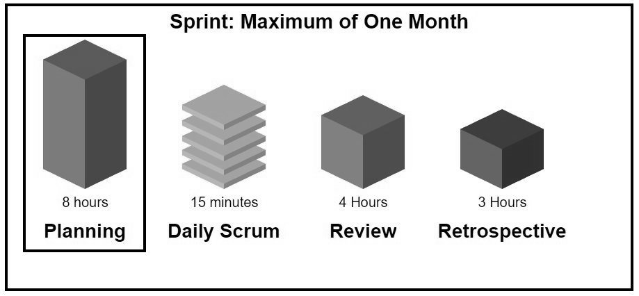
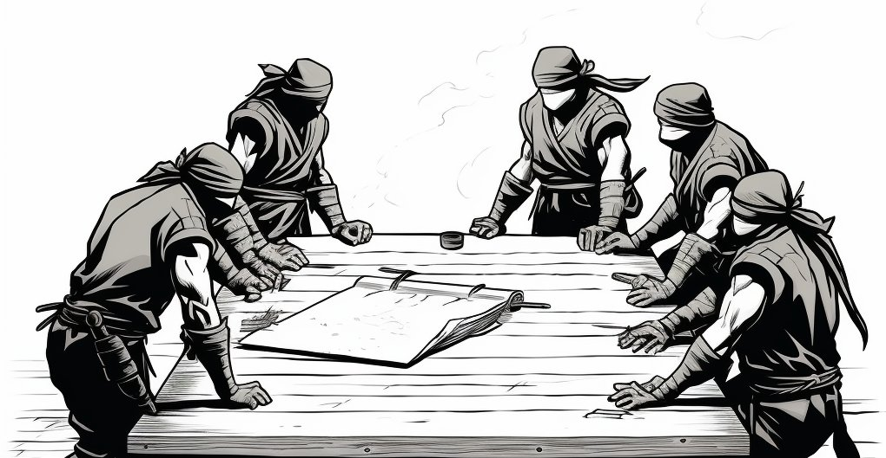

== Chapter 10: Sprint Planning

Scrum is simple. It really is.

I often hear people say they hate Scrum because it's too complicated, but I just don't see how that's possible. At the heart of it, Scrum just says this:

- Teams should take a bit of time every month or so to plan out the work they're going to do
- Developers should meet for 15 minutes every workday just to get the ball rolling again
- At least once a month developers should share what they've done with stakeholders
- After talking to stakeholders, the team should talk a bit about what did and didn't work

That's it. That's the basics of Scrum right there.

I honestly don't know how anyone could say a strategy like that is a bad thing. It seems pretty basic, pretty reasonable, and pretty straightforward to me.

And it all starts with Sprint Planning.

.Sprint Planning is the first of the four Scrum events that take place within a Sprint.

[quote, 2020 Scrum Guide page 8]
____
Sprint Planning initiates the Sprint by laying out the work to be performed for the Sprint. 

This resulting plan is created by the collaborative work of the entire Scrum Team.
____

Harking back to a theme we've crowed about before: Sprint Planning happens within the Sprint, not before the Sprint begins.

Many questions on the Scrum Master certification exam will suggest that Sprint Planning happens before the Sprint, but that's always a red herring.

None of the Scrum events happen _before_ or _after_ a Sprint. Every Scrum event takes place _within_ the Sprint.

=== Product Backlog Items and the Product Goal

[quote, 2020 Scrum Guide page 8]
____
The Product Owner ensures that attendees are prepared to discuss the most important Product Backlog items and how they map to the Product Goal. 
____

We learned earlier in the section about the Product Owner that the PO is the one accountable for maximizing the value of the product created by the Scrum Developers.

Here the Scrum Guide re-emphasizes that point, stating that the Product Owner comes to the Sprint Planning meeting with a list of the most important features for the team to work on. 

=== Who's Invited to the Sprint Planning Meeting?

[quote, 2020 Scrum Guide page 8]
____

The Scrum Team may also invite other people to attend Sprint Planning to provide advice.
____

Notice how anyone can be invited to participate in the Sprint Planning meeting. That's a significant point and a concept you'll be tested on often.

There are often multiple Scrum Teams working on a single product.

Remember, the maximum size of a Scrum team is 10 people, but it's not unusual for an enterprise software development project to have thirty or forty developers working on it. That means there will be at least four or five Scrum teams all working on the same product at the same time.

=== Minimizing Inter-team Dependencies

So how do multiple teams avoid stepping on each other's toes, working on the same backlog items at the same time, or working on items that might block another team's progress? 

How do teams avoid being blocked by a dependency their chosen work has on something that has to be completed by another team first?

One way to manage these issues is to have representatives from other Scrum Teams attend your team's Sprint Planning meeting. Representatives from other teams can share their progress, insights, and even deliverable dates for dependencies your project might have on their work.

Or better yet, if you know that certain Product Backlog items have dependencies on work that might not get completed by another team by the time you need them, then you can just pick different backlog items to work on. 

The fewer the dependencies your work has on other teams, the better.

<<<
==== Test Yourself

****
The Scrum Developers might want to invite someone outside the Scrum Team to attend the Sprint Planning meeting to discuss pertinent issues.

Which of the following is true about people from outside the Scrum Team participating in the Sprint Planning event?
(Choose 1)

* [ ] A) Outsiders can discuss how Product Backlog items align with corporate strategy and business goals
* [ ] B) Outsiders can discuss how certain Product Backlog items may be of importance to customers
* [ ] C) Outsiders can discuss dependencies on other Product Backlog items under development by other teams
* [ ] D) Outsiders can discuss risks or problems that might be encountered in the current Sprint
* [ ] E) All of the above are true.

****

Option E is correct.

There is nothing in the Scrum Guide that forbids Scrum Developers from inviting people outside the team to the Sprint Planning meeting, and there are no pragmatic restriction on what outsiders can talk about. 

If someone outside the Scrum Team can provide guidance on how to best plan the Sprint, they are more than welcome to speak up and contribute during Sprint Planning.

'''

==== Test Yourself

****
It is the Scrum Master's responsibility to ensure all Sprint Planning attendees are ready and prepared to discuss the Product Backlog.

* [ ] True
* [ ] False

****

This is false. It's the _Product Owner_ who ensures attendees are prepared to discuss how Product Backlog items map to the Product Goal.

Don't over-assign responsibilities to the Scrum Master. The name 'Scrum Master' is deceptively authoritative. The reality is, the Scrum Master has very few powers on the Scrum Team outside of coaching people on how to implement Scrum effectively.

The Product Owner owns the Product Backlog. Duties related to the Product Backlog typically fall in the Product Owner's lap.

<<<

=== Answering Why, What, and How

The goal of Sprint Planning is to come up with good answers to the questions of why, what, and how. You'll be asked 'straight up' on the Scrum Master certification exam which three questions the Sprint Planning event tries to solve.

[quote, 2020 Scrum Guide page 8]
____
Sprint Planning addresses the following topics:

- Topic One: Why is this Sprint valuable?
- Topic Two: What can be Done in this Sprint?
- Topic Three: How will the chosen work get done?

Sprint Planning is timeboxed to a maximum of eight hours for a one-month Sprint. 

For shorter Sprints, the event is usually shorter.
____

=== Time Boxing Sprint Planning to 8 Hours

To pass the Scrum certification exam you have to know the timeboxes for Scrum events like you know the back of your hand.

Memorize these:

- Sprint Planning is timeboxed to a maximum of 8 hours for a one-month Sprint
- The Daily Scrum is timeboxed to a maximum of 15 minutes
- The Sprint Review is timeboxed to a maximum of 4 hours
- The Sprint Retrospective is timeboxed to a maximum of 3 hours

==== Test Yourself

****
Which of the following Scrum events can last the longest?

* [ ] A) Daily Scrum
* [ ] B) Sprint Review
* [ ] C) Sprint Planning
* [ ] D) Sprint Retrospective
* [ ] E) The Review, Planning, and Retrospective are all time-boxed to 4 hours
* [ ] F) There is no time limit for the Sprint Planning

****

The answer to this question is C, Sprint Planning.

Sprint Planning is timeboxed to a maximum of 8 hours. Hopefully, your team can get it done a bit faster.

<<<

=== Why is the Sprint valuable?
[quote, 2020 Scrum Guide page 8]
____
The Product Owner proposes how the product could increase its value and utility in the current Sprint.
____

It is the Product Owner who is responsible for ensuring the work of the Scrum Team produces the greatest amount of value.

The Product Owner knows what needs to be built to make the product better. However, the Product Owner has no innate knowledge  of _how_ to build it. That's the job of the developers.

==== Negotiating Product Backlog Item Selection

During Sprint Planning, the Product Owner can only propose their ideas of what should be built next. 

The Developers may have pragmatic objections to what the Product Owner proposes and push for other Product Backlog items to be made part of the current Sprint instead.

Just think about a Scrum Team constructing a house. 

The Product Owner would likely want the kitchens and the bathrooms done first, but the foundation of the house may not be laid. In that case, the developers would need to explain how the kitchen and the bathrooms will need to wait for a future Sprint as the home's foundation has to be poured first.

Figuring out exactly what's required to implement a Product Backlog item is known as _decomposition._

.The Developers will negotiate with the Product Owner over which PBIs can feasibly be selected for the Sprint.

<<<

==== Test Yourself

****
Who on the Scrum Team is responsible for maximizing the value of the work performed by the developers? (Choose 1)

* [ ] A) The Scrum Master
* [ ] B) The Product Owner
* [ ] C) The Scrum Developers
* [ ] D) The Scrum Team as a whole
* [ ] E) The stakeholders

****

Option B is correct.

Maximizing the value of the work performed by the Scrum Team is the job of the Product Owner.

'''

==== Test Yourself

****
Who first proposes an initial plan for the Sprint at the Sprint Planning meeting? (Choose 1)

* [ ] A) The Scrum Master
* [ ] B) The Product Owner
* [ ] C) The Scrum Developers
* [ ] D) The Scrum Team as a whole
* [ ] E) The stakeholders

****
Option B is correct.

It is the Product Owner who presents a list of Product Backlog items they would like to have built in the current Sprint.

This becomes the starting point for negotiations, suggestions, decomposition and compromises during Sprint Planning.

<<<

=== Sprint Planning and the Sprint Goal

The Sprint Goal must be finalized by the end of the Sprint Planning meeting, and while other things may change during a Sprint, the Sprint Goal is one of the Scrum artifacts that is not allowed to be edited, adjusted, or changed once Sprint Planning has concluded.

[quote, 2020 Scrum Guide page 8]
____
The whole Scrum Team then collaborates to define a Sprint Goal that communicates why the Sprint is valuable to stakeholders.

The Sprint Goal must be finalized before the end of Sprint Planning.
____

Each Sprint needs a goal. The Sprint Goal keeps the developers focused throughout the Sprint.

The Sprint Goal also provides another important function - it provides transparency into the Sprint, as it allows stakeholders to know what developers are working towards.

The Sprint Goal must be finalized before the Sprint Planning meeting ends and it cannot change throughout the Sprint. The Sprint Plan can change, and the items in the Sprint Backlog can change. It's expected that those things will change as conditions change throughout the Sprint. But the Sprint Goal must be finalized before the Sprint Planning meeting ends, and it cannot change during the Sprint.

==== Test Yourself

****

What happens if it becomes clear towards the end of the Sprint that the team will not achieve the Sprint Goal? (Choose 1)

* [ ] A) The Sprint is canceled and a new Sprint Planning meeting takes place
* [ ] B) The next Sprint adopts the current Sprint's Goal continuously  until the goal is achieved
* [ ] C) The developers update the Sprint Goal so that it is achievable by the end of the Sprint
* [ ] D) The developers talk about the Sprint Goal during the Sprint Retrospective

****

Option D is correct.

It's not unusual for a Sprint Goal to go unfulfilled. Sometimes things just don't go according to plan.

If the Sprint Goal is not achieved, the Scrum Team talks about what they can do better during the Sprint Retrospective.

Nothing ever gets automatically rolled over from one Sprint into the next. Each Sprint starts new with an empty Sprint Backlog, as it's assumed that since conditions, expectations, and realities are constantly changing, what made sense when the prior Sprint was planned won't necessarily make sense for the current one.

The only exception to this rule is when suggestions on how to improve team practices made during the Sprint Retrospective get added to the next Sprint's Sprint Backlog. Other than that one corner case, items in the Sprint Backlog are never carried over from one Sprint to the next.

<<<

==== Test Yourself

****

Who creates the Sprint Goal? (Choose 1)

* [ ] A) The Scrum Master
* [ ] B) The Product Owner
* [ ] C) The Scrum Developers
* [ ] D) The Scrum Team as a whole
* [ ] E) The stakeholders

****

Option D is correct. 

The Scrum Team as a whole creates the Sprint Goal.

'''

==== Test Yourself

****

Who is allowed to view the Sprint Goal? (Choose 1)

* [ ] A) The Scrum Master
* [ ] B) The Scrum Developers
* [ ] C) Only members of the Scrum Team 
* [ ] D) The Scrum Team and stakeholders

****

Option D is correct.

The Sprint Goal helps to build transparency into the development process by allowing stakeholders to know what the team is trying to achieve during the current Sprint.

'''

=== Product Backlog Item Selection

[quote, 2020 Scrum Guide page 8]
____
Through discussion with the Product Owner, the Developers select items from the Product Backlog to include in the current Sprint. 

The Scrum Team may refine these items during this process, which increases understanding and confidence.
____

During Sprint Planning, the Product Owner proposes what they believe should be built during the Sprint. The Product Owner explains what they believe will provide the most value to stakeholders and customers. However, it's the developers who decide which Product Backlog items get added to the Sprint.

Going back to the home construction analogy, the construction workers know more about how to build a house than the homeowner.

The developers know what dependencies exist, what order certain Product Backlog items need to be created in, and what's the best path forward in order to complete the highest value Product Backlog items.

The developers, not the Scrum Master or the Product Owner, have the final say over what gets added to the Sprint.

=== Product Backlog Refinement

While Sprint Planning is an opportunity for the developers to talk about Product Backlog items, clarify them and refine them, this is not the only time developers are allowed to talk with the Product Owner. The developers can call up the Product Owner at any time during the Sprint to clarify details about Product Backlog items. 

Quite often the Product Owner works out of the same war room as the developers. That way the PO can answer developer's questions about the product as soon as they arise.

The Scrum Master certification exam will often provide an incorrect option that indicates there are only certain times a developer can talk to a stakeholder or Product Owner. Discussion between everyone on the Scrum Team and every stakeholder in the organization is never discouraged in the Scrum Guide. The more conversations the better!

==== Test Yourself

****
The Product Owner selects which Product Backlog items the developers will work on during the Sprint.

* [ ] True
* [ ] False

****

This is false.

The Product Owner can prioritize the Product Backlog and inform the developers about which Product Backlog items provide the most value, but the developers have the final say over which items they build during the Sprint.

'''

==== Test Yourself

****
Sprint Planning is the only time Scrum Developers are allowed to talk to the Product Owner to discuss Product Backlog items.

* [ ] True
* [ ] False

****

This is false.

The Product Owner should always be available to answer questions about the product.

Conversations between the Product Owner, the developers, the Scrum Master, and the stakeholders should happen freely and openly. Nothing in the Scrum Guide forbids it.

'''

=== What can be Done in this Sprint?

[quote, 2020 Scrum Guide page 8]
____
Selecting how much can be completed within a Sprint may be challenging. 

However, the more the Developers know about:

- their past performance, 
- their upcoming capacity, and;
- their Definition of Done, 

the more confident they will be in their Sprint forecasts.
____

According to the Scrum Guide, it's the Scrum Developers who are expected to estimate how much can be done in a Sprint.

It is up to the Scrum Developers to know about their capacity, past performance, and ability to follow through on the Definition of Done to estimate how much work they can accomplish.

This makes sense. After all, it is the developers who choose the PBIs they plan to implement in the Sprint. If they were unable to estimate their work capacity, they wouldn't know how many Product Backlog items to choose.

==== Test Yourself

****

Who estimates how much work can be accomplished in a Sprint? (Choose 1)

* [ ] A) The Scrum Master
* [ ] B) The Product Owner
* [ ] C) The Scrum Developers
* [ ] D) The Scrum Team as a whole
* [ ] E) The Scrum Team and stakeholders

****

Option C is correct.

The Developers are the ones who select how many Product Backlog items to include in the Sprint. The Developers are the ones who are estimating how much they believe can be accomplished.

<<<

==== Test Yourself

****

Which of the following are the most _empirical_ measures of how much the Scrum Developers can accomplish in a given Sprint?
(Choose 2)

* [ ] A) Burndown charts
* [ ] B) Past performance
* [ ] C) Burnup charts
* [ ] D) Upcoming capacity

****

Options B and D are correct.

Upcoming capacity and knowledge of past performance are more empirical measures than burndown or burnup charts.

'''

=== How will the chosen work get done?

[quote, 2020 Scrum Guide page 8]
____

For each selected Product Backlog item, the Developers plan the work necessary to create an Increment that meets the Definition of Done. 

This is often done by decomposing Product Backlog items into smaller work items of one day or less. 
How this is done is at the sole discretion of the Developers. No one else tells them how to turn Product Backlog items into Increments of value.

____

A Product Backlog item may take months to complete.

In Scrum, the Developers need to break epic Product Backlog items down into smaller pieces. This is known as decomposition.

The goal of decomposition is to break each Product Backlog item down into a series of chunks that can be estimated to take a day or less to complete.

=== No Points or User Stories in Scrum

Note that the Scrum Guide never talks about _points_ or _user stories._

Quite often you will see a question on the Scrum Master certification exam where one of the answers talks about breaking user stories down into a certain number of points. Those answers are always wrong.

That's not to say Scrum Teams can't use points or user stories if they find them helpful. It's just that they're not discussed in the Scrum Guide and are not a part of the Scrum Framework. 

The Scrum Master certification exam is testing you on Scrum, not peripheral processes and methodologies people sometimes integrate into Scrum.

==== Test Yourself

****

What is the best way for a developer to approach a complicated Product Backlog item? (Choose 1)

* [ ] A) Have the development team break the Product Backlog item down into smaller user stories.
* [ ] B) Have the Product Owner break the Product Backlog item down into smaller user stories.
* [ ] C) Break the Product Backlog item down into 1-point increments, representing 1 day of work.
* [ ] D) Break the Product Backlog items into multiple work items of one day or less

****

Option D is correct.

The term 'user story' is never mentioned once in the Scrum Guide. Neither is 'points.' That makes the first three options wrong.

Given an epic Product Backlog item, the Scrum Developers should try to decompose it into multiple, smaller work items that will take a day or less for a developer to complete.

By the way, the previous sentence used the term 'epic.' This is a common term in the world of Agile development, but the term 'epic' never appears once in the Scrum Guide.

'''

=== The Outcome of Sprint Planning

[quote, 2020 Scrum Guide page 9]
____
The Sprint Goal, the Product Backlog items selected for the Sprint, plus the plan for delivering them are together referred to as the Sprint Backlog.
____

Note that the Sprint Backlog is more than just the set of Product Backlog items the team has selected for the Sprint. It also includes a Sprint Goal that cannot change during the Sprint, along with a plan that is expected to change daily.

==== Test Yourself

****

The Sprint Backlog is composed of: (Choose 1)

* [ ] A) The Product Backlog items selected for the Sprint
* [ ] B) The Product Backlog items selected for the Sprint, and the Sprint Goal
* [ ] C) The Product Backlog items selected for the Sprint, the Sprint Goal, and the Sprint Plan
* [ ] D) The Product Backlog items selected for the Sprint, the Sprint Goal the Sprint Plan, and the Product Goal

****

Option C is correct. 

The Sprint Backlog consists of the Product Backlog items selected for the Sprint, the Sprint Goal and the Sprint Plan.

