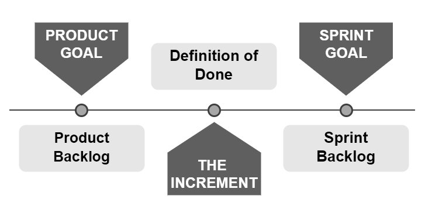

== Chapter 14: The Scrum Artifacts

There are three Scrum artifacts:

- The Product Backlog
- The Sprint Backlog
- The Increment of work the developers create

[quote, 2020 Scrum Guide page 10]
____
Scrum’s artifacts represent work or value. 

They are designed to maximize the transparency of key information. 

Thus, everyone inspecting them has the same basis for adaptation.
____

=== Answering Three Important Questions

The existence of these artifacts helps provide transparency by answering the three questions stakeholders constantly want answers to:

- What is currently being done? That's answered by the Sprint Backlog
- What needs to be done? That's answered by the Product Backlog
- What's been done? That's answered by the Increments of work that have been produced

Stakeholders get angry and upset when they don't have answers to these questions. The existence of transparent and inspectable Scrum Artifacts tends to calm the nerves of nervous stakeholders.

.Each Scrum artifact, namely the Product Backlog, Sprint Backlog and the Increment, has a corresponding Scrum commitment. The Product Goal, Sprint Goal and the Increment are the Scrum commitments.

<<<

==== Test Yourself

****
The stakeholders are waiting on a new feature to be released and they want to know if it's being actively developed during this Sprint. Where would the stakeholders look to find this information? (Select 1)

* [ ] A) The Product Backlog
* [ ] B) The Sprint Backlog
* [ ] C) The Definition of Done
* [ ] D) The Sprint Goal

****

Option B is correct.

The Sprint Backlog provides transparency into what is being worked on during the current Sprint.

'''

=== Scrum Commitments

The _Scrum commitment_ is something new that was added to the 2020 Scrum Guide. Each artifact now maps to a Scrum commitment.

[quote, 2020 Scrum Guide page 10]
____

Each artifact contains a commitment to ensure it provides information that enhances transparency and focuses against which progress can be measured:

- For the Product Backlog it is the Product Goal.
- For the Sprint Backlog it is the Sprint Goal.
- For the Increment it is the Definition of Done.

These commitments exist to reinforce empiricism and the Scrum values for the Scrum Team and their stakeholders.
____

Every arrow needs a target. Each Scrum commitment act as a target for their corresponding artifact.

.Scrum commitments are the targets for the Scrum artifacts to aim at.

A Scrum commitment is the evaluation criteria against which a Scrum artifact is measured. Scrum commitments improve transparency and enhance a Scrum Developer’s focus as the project progresses.

==== Test Yourself

****
The goal of every Sprint is to create an Increment that lives up to what ultimate measure? (Choose 1)

* [ ] A) Standard performance metrics
* [ ] B) Quality Assurance review
* [ ] C) The Definition of Done
* [ ] D) A conflict-free merge into the master branch

****

C is correct.

The Increment commits to measuring up to and conforming to the Definition of Done.

'''

==== Test Yourself

****
How do the Scrum Artifacts reinforce empiricism for stakeholders? (Choose 1)

* [ ] A) They help the stakeholder's chart velocity
* [ ] B) They help Quality Assurance teams confirm quality metrics are achieved
* [ ] C) They provide insight into what has been done and what is being done
* [ ] D) They help stakeholders estimate the overall cost of the project

****

Option C is correct.

Empiricism is all about observation and experience. The Scrum Artifacts allow stakeholders to know precisely what has been done and exactly what is currently being worked on.

This provides more empirical evidence of the state of the project than burndown charts or cumulative flow diagrams.

'''

==== Test Yourself

****
True or False: The Scrum Artifacts exist to reinforce empiricism only for the Scrum Team.
****

This is false. The Scrum Artifacts are accessible to the Stakeholders as well as the Scrum Team. They help reinforce empiricism for everyone involved in the project.

