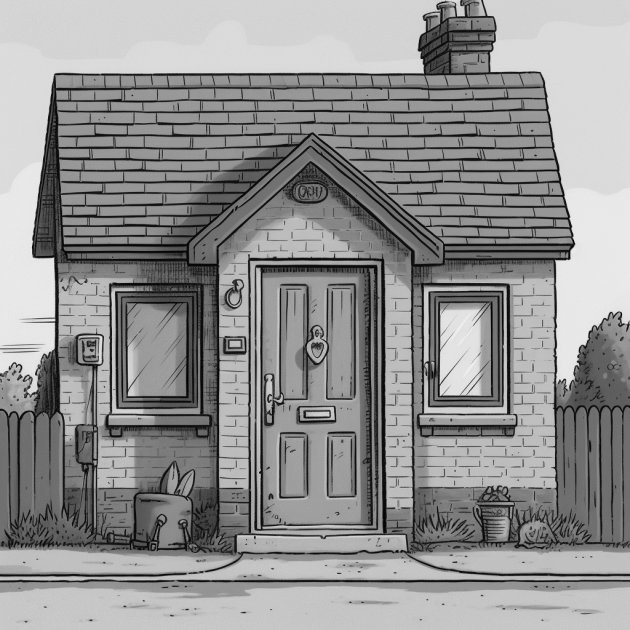

== Chapter 17: The Increment

Scrum is an iterative and incremental framework.

We see how Scrum is iterative through the cycling of Sprint after Sprint after Sprint. Within those Sprints, the same events occur over and over again.

But how is Scrum incremental?

=== Iterative and Incremental

In Scrum, we add to the product every Sprint. Every Sprint is supposed to deliver an Increment that is _useful_ and _valuable._ You never do a Sprint that doesn't try to create something useful.

There are no 'infrastructure Sprints' in Scrum where you just make sure everyone has the right software installed and access to the JIRA board.

In Scrum, every Sprint has to create something of value that adds to the existing product in a useful and meaningful way.

That's how Scrum is incremental. Every Sprint adds to what was created in the Sprints prior. That's the objective of every Sprint.

[quote, 2020 Scrum Guide page 11]
____ 

An Increment is a concrete stepping stone toward the Product Goal. 

Each Increment is additive to all prior Increments and thoroughly verified, ensuring that all Increments work together. 

To provide value, the Increment must be usable.

____

.Like steps in a staircase, each Increment builds on top of previous increments. We move forward by iteratively creating valuable and usable increments that take us progressively closer to the Product Goal.

 

=== Integrated Increments

An Increment must be added to what's already been done, and it must be able to fully integrate and work with all previous increments. If an Increment isn't compatible with past Increments, then it's not a valid Increment. If an Increment stands alone and doesn't increase the value of the product built to date, then it's not valid.

On the certification exam, there will be many questions about _integration,_ which is intimidating, because there is no talk in the Scrum Guide about integration. 

- There are no integration teams in Scrum
- There are no specific Scrum events where integration happens
- The is no designated time for integration to happen

The words 'integrate' and 'integration' never appear once in the 2020 Scrum Guide.

=== Understanding Integration

However, integration is important when it comes to the creation of an Increment. Whatever you create today must 'integrate with' what you created yesterday for it to be a valid Increment.

Many questions on the Scrum Master certification exam will reference _integration._ 

Software developers get tripped up on the word 'integration' because they get visions of merging code or fixing Git conflicts or doing GitHub pull requests. Don't confuse yourself with those things. The idea of 'integration' is much simpler than that.

Just imagine you're a carpenter and you built a door for the house your team is building. The door is currently tied to the roof of your car. Is it integrated with the house?

No, a door sitting on the roof of your car that is supposed to go on the house you're building is not integrated with the house if it's strapped to the roof of your car.

When the door is put on its hinges, attached to the house, and it can swing open and closed freely then it can be considered _integrated._ When integrated, it becomes a useful, valuable Increment. 

By putting the door on the house, you have integrated your work into the product and you have added a valuable Increment of work that stakeholders can see, touch, feel, and even criticize.

=== A Poorly Integrated Increment

Now imagine you took the door off the roof of your car, tried to attach it to the house and:

- The door is too large
- The hinges are incompatible
- You realize the door is the wrong color

<<<

You've done work on the door, there's no arguing about that. But has that work been integrated?

Did you just create a usable Increment of work that adds to the existing project? No, you didn't, because your door is useless.

.If a house needs a door, and you have the door at the ready, you don't wait a week to integrate it.

=== When to Integrate

Let's go back to the super, amazing door you created. When should you attach your perfect door to the house?

The Scrum Master exam will often ask you when you should integrate your work into the existing project. People get all flustered with these questions, wondering when the best time is to integrate your work.

Don't get flustered. Get pragmatic. 

When you think about integration pragmatically, the questions answer themselves.

 

=== The Right Time to Integrate

So, when should you integrate your work into the existing product?

- During the Daily Scrum?
- During the Sprint Review?
- During the Sprint Retrospective?
- During the Sprint Planning?
- Right now?

'Right now' is the correct answer. 

If you've got the perfect door ready to be put on your new house's hinges, you don't sit for two weeks waiting for the Sprint Review to do it. You integrate it right away. 

It would be nuts to imagine waiting two weeks to hang the front door on the house, or as we'd say in Scrum, 'integrate your work into the product.' 

As soon as your work is done you integrate your work. Then you move on to the next piece of work that needs to be done. You keep doing that over and over and over again until it's time for the Sprint Review.

Scrum prides itself on being based on _lean principles._ Waiting around is not lean. Doing something right away is lean. On the Scrum Master exam, a lean approach to product building is the correct approach.

==== Test Yourself

****
Which one of the following is correct? 

* [ ] A) Scrum is incremental but not iterative.
* [ ] B) Scrum is iterative but not incremental.
* [ ] C) Scrum is both incremental and iterative.
* [ ] D) Scrum is neither incremental nor iterative.

****
Option C is correct.

Scrum is iterative in that a set of steps get repeated each Sprint, and it is incremental in that each Sprint produces Increments of work that get added to all past increments.

<<<

 

=== Multiple Increments

The goal of each Sprint is to get at least one valuable and usable Increment added to the project, but that shouldn't stop you from integrating as many Increments as you can.

If a carpenter adds a front door to a house, she doesn't wait until the next Sprint to start working on the back door. She gets working on the back door and integrates that into the house as soon she's done with that. Increments should keep being added to the product constantly throughout Sprint.

[quote, 2020 Scrum Guide page 12]
____

Multiple Increments may be created within a Sprint. 

The sum of the Increments is presented at the Sprint Review thus supporting empiricism. 

However, an Increment may be delivered to stakeholders before the end of the Sprint. 

The Sprint Review should never be considered a gate to releasing value.

Work cannot be considered part of an Increment unless it meets the Definition of Done.
____

=== Continuous Delivery of Valuable Increments 

Some people get the impression that the only time stakeholders should be allowed to see what developers have done is at the Sprint Review.

If developers create an Increment they want the stakeholders to see, nothing is stopping them from presenting it to them at any time throughout the Sprint. And why should a developer wait to show off their amazing work? 

If the developers have created something they are proud of, and the stakeholders are anxious to see it, why would the development team wait  until the Sprint Review to show it to them?

The Sprint Review makes sure the stakeholders get to see progress at least once throughout a Sprint, but that just ensures a minimum. Developers are always encouraged to be transparent and share their progress with interested stakeholders.

=== Commitment: The Definition of Done

[quote, 2020 Scrum Guide page 12]
____
The Definition of Done is a formal description of the state of the Increment when it meets the quality measures required for the product.

The moment a Product Backlog item meets the Definition of Done, an Increment is born.
____

The Definition of Done must be clear and understood by everyone on the Scrum Team. It must also be understood by the stakeholders and the organization. It creates a common understanding of what has to be done for a feature to be complete.

==== Test Yourself

****
The Definition of Done is an informal understanding of what needs to be done to turn a Product Backlog item into an Increment.

* [ ] True
* [ ] False

****

This is false

The Definition of Done is a _formal description,_ not an informal understanding.

'''

==== Test Yourself

****
The application has failed to scale beyond a single processing core, and this has caused various production issues. 

What is the best way for the Scrum Team to proceed with this issue? (Choose 1)

* [ ] A) Assign multi-core processing support to the DevOps team
* [ ] B) Create a testing team to implement multi-processor support
* [ ] C) Add multi-processor support to the Definition of Done
* [ ] D) Inform that the QA team that they should test the app on multiple processors

****
Option C is correct.

If there is a quality metric that the product must support, it is the development team's responsibility to support it. If the multi-core requirement is added to the Definition of Done, the developers will not be allowed to integrate or release any increments that don't meet the multi-core requirement.

Remember that there are no sub-teams in Scrum, and there is no talk anywhere about DevOps, UAT, or QA teams in the Scrum Guide.

<<<

 

=== Scrum Pillars, Transparency, and 'Done'

[quote, 2020 Scrum Guide page 12]
____

The Definition of Done creates transparency by providing everyone with a shared understanding of what work was completed as part of the Increment. 

If a Product Backlog item does not meet the Definition of Done, it cannot be released or even presented at the Sprint Review. 

Instead, it returns to the Product Backlog for future consideration.
____

Test takers are often killed on this point, so pay attention.

When a Product Backlog item is not completed during a Sprint, it is put back into the Product Backlog.

- It's not presented at the Sprint Review
- It is not 'partially presented' at the Sprint Review
- Partial points are not assigned to it (There are no 'points' in Scrum!)
- The feature is not automatically added to the next Sprint's Sprint Backlog
- The feature is not partially released

If a Product Backlog item selected for the Sprint does not meet the Definition of Done by the end of the Sprint, it is thrown back into the Product Backlog as though nobody had ever even been working on it. Even if it's 90% complete, it's thrown back into the Product Backlog for the Product Owner to reprioritize.

==== Test Yourself

****
An important, critical feature is 99% done but it won't be ready for the Sprint Review tomorrow. 

What should the team do? (Choose 1)

* [ ] A) Present the work that was completed for stakeholders to see at the Sprint Review
* [ ] B) Assign 99% of the points to the current Sprint and assign 1% of the points to the next Sprint
* [ ] C) Automatically add the Product Backlog item to the next Sprint's Sprint Backlog
* [ ] D) Extend the Sprint to allow the developer to get the feature to 100%
* [ ] E) Return the item to the Product Backlog and do not present it at the Sprint Review

****

Option E is correct.

The Scrum Guide is clear. If a feature does not meet the Definition of Done, it is not presented at the Sprint Review, and it is returned to the Product Backlog.

<<<

=== Organizational Standards

[quote, 2020 Scrum Guide page 12]
____

If the Definition of Done for an Increment is part of the standards of the organization, all Scrum Teams must follow it as a minimum. 

If it is not an organizational standard, the Scrum Team must create a Definition of Done appropriately for the product.
____

Who creates the Definition of Done?

It's created by the Scrum Team unless there is already an existing organizational standard.

If the Scrum Team wants to create a more rigorous Definition of Done, they are certainly allowed to do that, but it must build on top of the one the company already has. It cannot be more lax.

=== Done Over Time

One of the interesting things that happens with Scrum Teams as they become more familiar with the framework and the product they are building is they extend and enhance their Definition of Done. 

Over time, the Definition will likely become more rigorous, with more quality gates to pass than when the team first adopted Scrum.

****
Who creates the Definition of Done? (Choose 1)

* [ ] A) The Product Owner if there is no organizational standard
* [ ] B) The Scrum Master if there is no organizational standard
* [ ] C) The Scrum Team if there is no organizational standard
* [ ] D) The stakeholders if there is no organizational standard

****

Option C is correct.

The Scrum Team creates a Definition of Done if an organizational standard does not exist.

'''

=== Bad Definitions of Done

Sometimes Scrum Teams will find themselves in a situation where they are dealing with a Definition of Done that is impossible to achieve.

For example, if the Definition of Done says every piece of code has to be tested on a quantum computer with 100,000 qubits, despite the fact that no computer in the world has more than 1000 quibits, then the Definition of Done is too rigorous.

The Definition of Done should not be changed too often, and it's not a good idea to make a Definition of Done less rigorous over time, but if the Definition of Done includes a requirement that is impossible to achieve due to missing hardware, software or infrastructure, then it is permissible to change the Definition of Done to make it possible to deliver a usable Increment.

If the Definition of Done does need to change, such a discussion is best to take place during the Sprint Retrospective.

=== Multiple Teams and the Definition of Done

[quote, 2020 Scrum Guide page 12]
____
The Developers are required to conform to the Definition of Done. 

If multiple Scrum Teams are working together on a product, they must mutually define and comply with the same Definition of Done.
____

There are only a few instances in the Scrum Guide where it discusses multiple teams working on the same project.

The rules the Scrum Guide requires for multiple teams working on the same project are few, but they are important and you will be tested on them. 

The Scrum Guide demands that multiple teams that work on the same project must:

- Each share the same Product Owner
- Each share the same Product Backlog
- Each share the same Product Goal
- Each share the same Definition of Done

=== What Scrum Doesn't Say About Multiple Teams

There is nothing in the Scrum Guide that asserts multiple teams working on the same project must:

- Start their Sprints at the same time
- Have Sprints that are the same length
- Have the same number of team members
- Have the same Scrum Master

There will be several questions about multiple teams working on the same project on the certification exam, and those questions will provide options that seem reasonable but are incorrect.

When answering questions on the certification exam, focus on answers that map as closely as possible to what is explicitly stated in the Scrum Guide.

<<<

==== Test Yourself

****
What must be shared between multiple teams working on the same product at the same time? (Choose 2)

* [ ] A) The Product Owner
* [ ] B) The Scrum Master
* [ ] C) The Sprint Backlog
* [ ] D) The Product Backlog
* [ ] E) Multiple Scrum Teams cannot work on the same product at the same time

****

Options A and D are correct.

Each Scrum Team has its own Sprint Backlog. A Sprint Backlog is not shared across multiple teams working on the same product.

A Scrum Master can be shared between multiple teams, or a Scrum master can dedicate 100% of their time to one team. The Scrum Guide doesn't advise for or against either scenario.

When multiple teams work on the same project together:

- Each team shares the same Product Owner
- Each team shares the same Product Backlog
- Each team shares the same Product Goal
- Each team shares the same Definition of Done

'''

