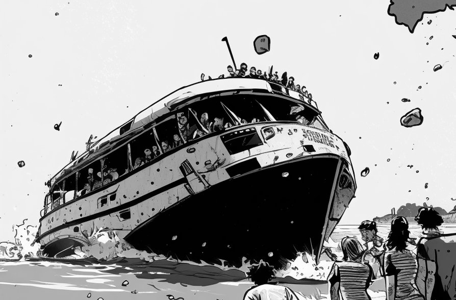
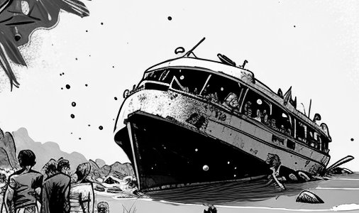

== A Simple Trick

Here's a simple trick to correctly answering some of the hardest questions you'll face on the Scrum Master certification exam. I've alluded to it throughout the book, but I really want to drive the idea home with the next mock Scrum Master exam.

=== A Hack to Help You Pass the Exam

Most people who take the Scrum Master exam come from the world of software development. That can really clutter your mind when answering a certification exam question.

So instead of thinking about how a given exam question applies to the field of software development, reframe the question in a completely different domain. 

.Reframing exam questions  outside of software development makes them easier to answer.

The following exam questions are a mirror image of the first set of questions you were just asked, but reframed in a much more rediculous and extreme scenario. 

The scenario used for the next set of quetsions is that of a shipwreck where a survivors from a marooned party boat are forced to build a survival camp as they await rescue.

- The life-and-death scenario in which the questions are framed help simplify the interpretation of Scrum
- The rediculousness makes the questions a bit more interesting. 

I think you'll find the next set of questions to be a bit more fun to answer than they prototypical Scrum Master certification exam questions. You’ll also find that they’ll give you a deeper understanding of the Scrum framework as well.

== The Party Boat Disaster

A party boat from a popular tech conference was blown off course by a surprise typhoon, and 100 injured developers are now shipwrecked on a deserted island somewhere in the south pacific.

The ship is marooned on rocky coral, stranded about 30 meters from the island's shore, and most of the survivors are too injured to make it to dry land.

Nobody knows what to do. Fortunately, one developer took a Scrum courses and has a copy of the 2020 Scrum Guide with them. 

The castaways are going to make it through this ordeal, and a Scrum based approach to survival will guide them through it.

Their first task? Get a team of developers to go to shore and build a survival camp.
10 Scrum Master exam questions

.The following set of questions frame Scrum in a life-or-death survival scenario where castaways from a shipwreck must build a survival shelter.

=== Questions

==== Question 1

Scrum is software development process and should not be applied to life-or-death tasks like building a survival shelter.

* [ ] True
* [ ] False

==== Question 2

You, the Scrum Master, have outdoors experience. You would like to be a developer on the first Sprint and help build the temporary shelter. 

How should you proceed in order not to violate the rules of the Scrum Guide?

* [ ] A.	You must temporarily assign Scrum Master duties to another person while you act as a developer
* [ ] B.	You must temporarily assign Scrum Master duties to the Product Owner while you act as a developer
* [ ] C.	You must participate in the Daily Scrum during the Sprint
* [ ] D.	Scrum Masters cannot be a developer on their Scrum Team

==== Question 3

A team of four developers, along with a Product Owner and the Scrum Master, have made it to shore and need to start building a survival shelter. However, the team is at odds over what they should do for the very first Sprint.

Whose approach is most in line with the ethos of the Scrum Guide?

* [ ] A.	Jim wants to declare a 'Sprint 0' where time is spent planning and designing the survival camp
* [ ] B.	Julie wants to spend the first Sprint searching the island for tools they can use to build the survival camp
* [ ] C.	Jeff wants to spend the first Sprint searching the island for edible food and clean water
* [ ] D.	Jessica wants to build a simple communication system from the camp to the ship using mirrors she salvaged

==== Question 4

Bob dug a trench to divert water from a nearby stream to the survival camp. Alan dug a trench so waste could be safely flushed from the survival camp out to sea.

The two trenches need to be joined. When is the best time to integrate these two trenches?

* [ ] A.	Integration should happen immediately assuming both trenches meet the definition of done
* [ ] B.	Integration should be coordinated with the rest of the team during the Daily Scrum
* [ ] C.	Integration should happen during the Sprint Review so stakeholders can be present
* [ ] D.	Integration should happen after approval is obtained from the Scrum Master
* [ ] E.	Integration should happen after approval is obtained from the Product Owner

==== Question 5

Tina has just spotted a poisonous snake on the outskirts of the camp. When should Tina inform the rest of the development team?

* [ ] A.	The development team should be informed immediately
* [ ] B.	The development team should be informed at the next Daily Scrum
* [ ] C.	The development team should be informed during the Sprint Retrospective
* [ ] D.	The development team should be informed during the Sprint Review
* [ ] E.	The development team should be informed after discussing the deadly snake with the Scrum Master
* [ ] F.	The development team should be informed after discussing the deadly snake the Product Owner

==== Question 6

Living conditions have become dire and progress on the survival camp has not been going as quickly as planned. Two developers and the Scrum Master will be returning to the marooned ship for two days to care for loved ones.

What instructions do you, the Scrum Master, have for the developers returning to the boat, knowing that the survivors on the ship are the primary stakeholders in the development of the survival camp.

* [ ] A.	Tell the developers not to directly interact with any of the stakeholders on the ship
* [ ] B.	Tell the developers to direct all questions from stakeholders about the survival camp to the Product Owner
* [ ] C.	Have developers tell stakeholders to hold any questions they have about the survival camp for the Sprint Review
* [ ] D.	Discuss progress about the survival camp openly and honestly with stakeholders whenever they ask about it

==== Question 7

Three healthy and enthusiastic survivors have swum ashore to help build the survival camp. 
Given the fact that a new, two-week Sprint has just started, when should these developers be added to the development team?

* [ ] A.	The developers should be added to the team immediately
* [ ] B.	The developers should be added to the team at the next Sprint Planning meeting
* [ ] C.	The developers should be added to the team when the current Sprint ends but before the next Sprint begins
* [ ] D.	The developers should be added to the team at the next Daily Scrum
* [ ] E.	New developers cannot be added to a team once product development has started

==== Question 8

Things have been running smoothly for the last three Sprints. However, three new developers with no experience in building a survival camp have just been added to the team.

What will happen to the individual productivity of the experienced developers?

* [ ] A.	A permanent decrease in productivity will occur
* [ ] B.	A short term decrease in productivity will occur
* [ ] C.	A permanent increase in productivity will occur
* [ ] D.	A short term increase in productivity will occur

==== Question 9

The Product Owner has decided the survival camp needs a canoe. However, nobody on the team has the skills to build a canoe. What should the team do?

* [ ] A.	Organize a sub-team dedicated to building a canoe
* [ ] B.	Outsource the building of a canoe to a third-party
* [ ] C.	Tell the Product Owner building a canoe is not possible
* [ ] D.	Figure out how to build a canoe

==== Question 10

A devastating flash flood has ripped through the survival camp and washed away the shelters the team spent the majority of the Sprint building.

How should the Scrum team proceed?

* [ ] A.	Have the developers regroup and adjust the Sprint Plan accordingly
* [ ] B.	Have the developers cancel the Sprint and begin a new Sprint Planning meeting
* [ ] C.	Have the developers put time aside during the next Daily Scrum to adjust the Sprint Goal
* [ ] D.	Tell the developers the Sprint Plan cannot be changed and they should continue with their original plan

== Answers

==== Question 1

****

Scrum is software development process and should not be applied to life-or-death tasks like building a survival shelter.

* [ ] True
* [ ] False

****

This is false.

Scrum is a way to help teams get started on the development of a product and help those teams iteratively solve complex problems until product development is complete.

Scrum is a lightweight, incomplete framework for product development. 

Scrum is not a process or a methodology, and it is definitely not to exclusively tied to the domain of software development.

==== Question 2

****

You, the Scrum Master, have outdoors experience. You would like to be a developer on the first Sprint and help build the temporary shelter. 

How should you proceed in order not to violate the rules of the Scrum Guide?

* [ ] A.	You must temporarily assign Scrum Master duties to another person while you act as a developer
* [ ] B.	You must temporarily assign Scrum Master duties to the Product Owner while you act as a developer
* [*] C.	You must participate in the Daily Scrum during the Sprint
* [ ] D.	Scrum Masters cannot be a developer on their Scrum Team

****

Option C is correct.

There's no rule that says a Scrum Master can't also be a developer.

Could you imagine a life or death survival situation where a Scrum Master refuses to offer assistance just because they have the title as 'Scrum Master?' The idea is preposterous.

Both a Scrum Master and the Product Owner can participate as developers on a Scrum Team. The only rule is that when doing product development, a PO or Scrum Master must attend the Daily Scrum and participate as unbiased developers.

==== Question 3

****

A team of four developers, along with a Product Owner and the Scrum Master, have made it to shore and need to start building a survival shelter. However, the team is at odds over what they should do for the very first Sprint.

Whose approach is most in line with the ethos of the Scrum Guide?

* [ ] A.	Jim wants to declare a 'Sprint 0' where time is spent planning and designing the survival camp
* [ ] B.	Julie wants to spend the first Sprint searching the island for tools they can use to build the survival camp
* [ ] C.	Jeff wants to spend the first Sprint searching the island for edible food and clean water
* [*] D.	Jessica wants to build a simple communication system from the camp to the ship using mirrors she salvaged

****

Option D is correct.

In Scrum, every Sprint must attempt to deliver some piece of usable and valuable functionality that will be part of the final product. 

Setting up infrastructure, configuring tools, planning, design and even finding food to eat are all noble tasks, but they all must occur in the background as the Scrum team focuses on the delivery of at least one increment of value before the end of the current Sprint.

==== Question 4

****

Bob dug a trench to divert water from a nearby stream to the survival camp. Alan dug a trench so waste could be safely flushed from the survival camp out to sea.

The two trenches need to be joined. When is the best time to integrate these two trenches?

* [*] A.	Integration should happen immediately assuming both trenches meet the definition of done
* [ ] B.	Integration should be coordinated with the rest of the team during the Daily Scrum
* [ ] C.	Integration should happen during the Sprint Review so stakeholders can be present
* [ ] D.	Integration should happen after approval is obtained from the Scrum Master
* [ ] E.	Integration should happen after approval is obtained from the Product Owner

****

Option A is correct.

If two developers have worked on a feature that is complete and meets the definition of done, they should integrate their work immediately.

Scrum prides itself on being based on lean thinking. How lean would it be to have developers wait around for a Scrum Master or Product Owner to tell them it's okay to integrate their work? 

If the work is done, it should be integrated immediately. After all, if the work does not successfully integrate, then it's not really 'done', is it?

Scrum doesn't put 'red tape', ceremony and procedure around the development process. Instead, Scrum is pragmatic and lean. When work is done, integrate it immediately and then move on to the next thing that needs to be built.

==== Question 5

****

Tina has just spotted a poisonous snake on the outskirts of the camp. When should Tina inform the rest of the development team?

* [*] A.	The development team should be informed immediately
* [ ] B.	The development team should be informed at the next Daily Scrum
* [ ] C.	The development team should be informed during the Sprint Retrospective
* [ ] D.	The development team should be informed during the Sprint Review
* [ ] E.	The development team should be informed after discussing the deadly snake with the Scrum Master
* [ ] F.	The development team should be informed after discussing the deadly snake the Product Owner

****

Option A is correct.

Obviously if something threatens the people working on the product, the existence of the threat should be brought up immediately. You don't wait for a planned event to warn your peers about a dangerous situation.

On the Scrum Master exam, they will ask you what should happen if a developer identifies a dangerous security flaw that threatens the project. People often stumble on this question, thinking maybe it's something to discuss at the Sprint Retrospective, or something to raise at the next Daily Scrum.

Scrum is pragmatic. If there's a serious problem, it should be addressed immediately. The Scrum Events should never act as an excuse to postpone important discussions about the health of the project.

==== Question 6

****

Living conditions have become dire and progress on the survival camp has not been going as quickly as planned. Two developers and the Scrum Master will be returning to the marooned ship for two days to care for loved ones.

What instructions do you, the Scrum Master, have for the developers returning to the boat, knowing that the survivors on the ship are the primary stakeholders in the development of the survival camp.

* [ ] A.	Tell the developers not to directly interact with any of the stakeholders on the ship
* [ ] B.	Tell the developers to direct all questions from stakeholders about the survival camp to the Product Owner
* [ ] C.	Have developers tell stakeholders to hold any questions they have about the survival camp for the Sprint Review
* [*] D.	Discuss progress about the survival camp openly and honestly with stakeholders whenever they ask about it

****

Option D is correct.

Could you imagine how much fear, uncertainty and distrust it would create in this scenario if a gag order was put on the people building the survival camp?

Furthermore, the idea that developers should not be allowed to talk to stakeholders in this scenario is asinine and paradoxical, because every one of the developers is a stakeholders. Everyone in this problem domain is a stakeholder.

People think Scrum has a whole set of rules that regulate when a developer is allowed to talk to a stakeholder or the product owner or a customer. It doesn’t. 

Scrum doesn't advocate secrecy and silence. Scrum advocates for transparency and openness.
If your organization has some rules about developers not talking to stakeholders, that's an entirely different issue. It's also an issue the Scrum Master might want to address. 

Rules that limit transparency and communication do not coincide the Scrum values and pillars.

==== Question 7

****

Three healthy and enthusiastic survivors have swum ashore to help build the survival camp. 
Given the fact that a new, two-week Sprint has just started, when should these developers be added to the development team?

* [*] A.	The developers should be added to the team immediately
* [ ] B.	The developers should be added to the team at the next Sprint Planning meeting
* [ ] C.	The developers should be added to the team when the current Sprint ends but before the next Sprint begins
* [ ] D.	The developers should be added to the team at the next Daily Scrum
* [ ] E.	New developers cannot be added to a team once product development has started

****

Option A is correct.

If you were in a life or death situation, and three people showed up who could potentially help save you, would you ask them to sit on the sidelines for two weeks until the next Sprint Planning meeting, or would you get them to work right away?

Which approach is more pragmatic and lean? Having developers sit on the sidelines doing nothing, or having them get to work right away?

If new developers become available, have them join the team and get to work immediately.

==== Question 8

****

Things have been running smoothly for the last three Sprints. However, three new developers with no experience in building a survival camp have just been added to the team.

What will happen to the individual productivity of the experienced developers?

* [ ] A.	A permanent decrease in productivity will occur
* [*] B.	A short term decrease in productivity will occur
* [ ] C.	A permanent increase in productivity will occur
* [ ] D.	A short term increase in productivity will occur

****

Option B is correct.

When new developers are added to a team, the onboarding process takes time, and it usually consumes the time of existing team members.

When new developers become familiar with the development process, productivity will go back to normal, but in the short term, individual productivity will fall.

==== Question 9

****

The Product Owner has decided the survival camp needs a canoe. However, nobody on the team has the skills to build a canoe. What should the team do?

* [ ] A.	Organize a sub-team dedicated to building a canoe
* [ ] B.	Outsource the building of a canoe to a third-party
* [ ] C.	Tell the Product Owner building a canoe is not possible
* [*] D.	Figure out how to build a canoe

****

Option D is correct.

It is assumed that all of the skills required to build out the various product backlog items exist within the team of Scrum developers, and if they don’t, the team will acquire them.

There are no sub-teams or hierarchies in scrum, and there’s certainly nobody to outsource to on a deserted island. When you take the Scrum Master certification exam, assume each test question is talking about an isolated team of developers unless the question states otherwise.

If one of the Product Backlog items is a canoe, then the team better learn how to carve out a canoe.

==== Question 10

****

A devastating flash flood has ripped through the survival camp and washed away the shelters the team spent the majority of the Sprint building.

How should the Scrum team proceed?

* [*] A.	Have the developers regroup and adjust the Sprint Plan accordingly
* [ ] B.	Have the developers cancel the Sprint and begin a new Sprint Planning meeting
* [ ] C.	Have the developers put time aside during the next Daily Scrum to adjust the Sprint Goal
* [ ] D.	Tell the developers the Sprint Plan cannot be changed and they should continue with their original plan

****

Option A is correct.

When circumstances change, developers should adapt immediately.

Scrum provides a number of scheduled events to ensure communication happens regularly, but those events are not the only times developers are allowed to communicate with each other. If something dramatic happens, developers should immediately adapt. Adaptation should be perpetual throughout a Sprint.

Note that while the Sprint Plan can change, the Sprint Goal cannot. The Sprint Goal is finalized at the end of Sprint Planning and cannot be changed throughout the Sprint.

It is also not possible for the developers or the Scrum Master to cancel a Sprint. Only the Product Owner can cancel a Sprint, and only under the circumstance where the Sprint Goal has become obsolete.

Don't overthink Scrum. Don't ever let the Scrum events be an excuse for not taking immediate action when immediate action is warranted.

